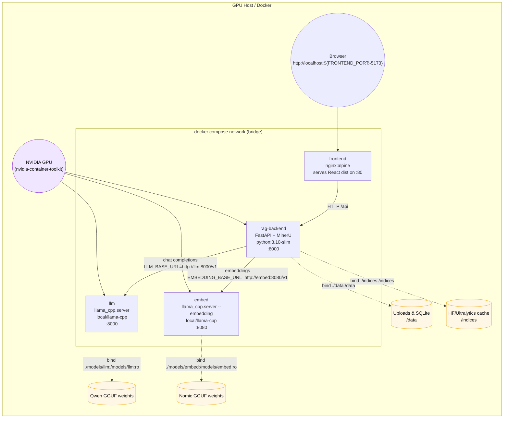

# System Architecture

This repository packages a local Retrieval-Augmented Generation stack as four containers orchestrated by Docker Compose.

## High-level notes
- `docker-compose.yml` defines `frontend`, `rag-backend`, `llm`, and `embed`; they share the default bridge network and resolve each other via service DNS.
- GPU acceleration flows in from the host through the NVIDIA Container Toolkit; backend + both llama.cpp services request GPU devices but fall back to CPU if unavailable.
- Bind mounts: `./data` → `/data`, `./indices` → `/indices`, `./models/llm` → `/models/llm:ro`, `./models/embed` → `/models/embed:ro`.
- Host ports: `${FRONTEND_PORT:-5173}` → nginx :80, `${BACKEND_PORT:-8000}` → FastAPI :8000, `${LLM_HOST_PORT:-8010}` → llama_cpp :8000, `${EMBED_HOST_PORT:-8011}` → embedding server :8080.
- The frontend proxies `/api` traffic to the backend, which orchestrates ingestion, chunking, retrieval, and calls the local llama.cpp endpoints for completions plus embeddings.

## Deployment diagram

## Service responsibilities
### frontend
- Multi-stage Dockerfile builds the Vite/React app (`node:18-alpine`) and serves the static bundle via `nginx:alpine`.
- Exposes container port 80 → host `${FRONTEND_PORT:-5173}`; nginx proxies `/api` to `rag-backend:8000` and allows 200 MB uploads.

### rag-backend
- Built from `backend/Dockerfile`; installs CUDA-enabled PyTorch, MinerU, FastAPI, and ingestion dependencies via `uv`.
- Runs `uvicorn app:app` on :8000 (mapped to `${BACKEND_PORT:-8000}`) and handles ingestion, chunking, retrieval, and chat endpoints.
- Stores uploads plus `rag_meta.db` inside `/data`; caches HuggingFace/Ultralytics assets under `/indices` to persist model downloads.
- Reads `.env` for parser knobs, `LLM_BASE_URL`, `EMBEDDING_BASE_URL`, API keys, and device settings (`MINERU_DEVICE_MODE`).

### llm
- Uses the custom CUDA-enabled `local/llama-cpp:latest` image from `docker/llama-cpp.Dockerfile`.
- Launches `python3 -m llama_cpp.server` with chat mode on port 8000 (host `${LLM_HOST_PORT:-8010}`) serving `LLM_MODEL`; enforces `LLM_API_KEY`.
- Mounts `./models/llm` read-only so GGUF weights stay on the host; reserves one GPU but can fall back to CPU.

### embed
- Shares the same base image as `llm` but starts `llama_cpp.server --embedding true` on port 8080 (host `${EMBED_HOST_PORT:-8011}`).
- Serves embeddings for `EMBEDDING_MODEL`, with weights mounted from `./models/embed:ro`; guarded by `EMBEDDING_API_KEY`.
- Backend batches chunk texts to this endpoint during ingestion before storing vectors in SQLite.

## Data & request flow
1. Users interact with `frontend` at `http://localhost:${FRONTEND_PORT:-5173}`; nginx serves static assets and proxies `/api/*` into the backend.
2. `rag-backend` writes uploaded PDFs to `/data`, extracts text (PyMuPDF fast path or MinerU GPU path), chunks content, and computes embeddings via the `embed` service.
3. Chunk metadata and vectors persist in SQLite (`/data/rag_meta.db`), while caches live under `/indices` to avoid re-downloading models.
4. During chat, the backend retrieves the most relevant chunks, builds prompts, and calls the `llm` service for completions that cite `[source N]` snippets returned to the UI.
