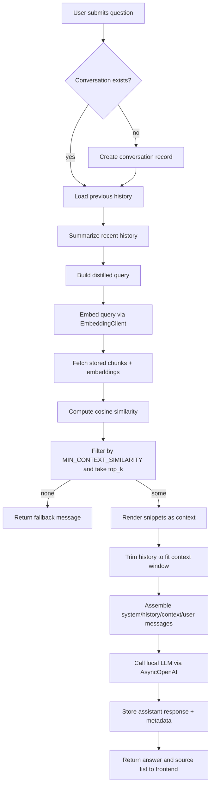

# Chat Flow Overview

This document summarizes the end-to-end chat algorithm implemented in `backend/app.py`. It highlights how a user query turns into a retrieval-augmented response and includes a Mermaid diagram of the control flow.

## Step-by-step explanation

1. **Conversation setup**  
   - `/ask` ensures the conversation exists in the SQLite store (`DocumentStore`). For new sessions it creates records; otherwise it loads prior messages.  
   - `_summarize_history` condenses the last few turns and `_build_distilled_query` prepends that summary to the current question so retrieval reflects the conversation context.

2. **Query embedding & retrieval**  
   - `EmbeddingClient` calls the local embedding service (`embed` container) to obtain a vector for the distilled query.  
   - The backend reads all chunk embeddings for the chosen parser (`mineru`) and computes cosine similarity.  
   - Only chunks whose similarity meets `MIN_CONTEXT_SIMILARITY` (default 0.35, configurable via `.env`) are kept, then truncated to `top_k`.
   - If no chunk clears the bar, the API immediately responds with `NO_CONTEXT_RESPONSE` instead of querying the LLM.

3. **Prompt construction**  
   - `_trim_history_for_budget` prunes old history until the token count fits `CHAT_CONTEXT_WINDOW - CHAT_COMPLETION_RESERVE`.  
   - The final `messages` list always includes:
     1. `SYSTEM_PROMPT` — instructs the LLM to answer strictly from snippets, cite `[source N]`, and note gaps without inventing details.  
     2. The trimmed history.  
     3. A second system message that enumerates the retrieved snippets (each labeled `[source N]`).  
     4. The current user request (or a continuation prompt if `continue_last` is true).

4. **LLM completion**  
   - The backend uses `AsyncOpenAI` pointed at the local llama.cpp server (`LLM_BASE_URL`) to request a chat completion with `temperature=0.2`.  
   - If the LLM call succeeds, it records the assistant reply, token estimates, and the context usage metrics before sending the response to the UI.

5. **Response payload**  
   - The frontend receives `AskResponse` containing the assistant answer, `sources` (the same snippets handed to the LLM), indicators about context usage/truncation, and whether the model stopped naturally.  
   - Those `sources` entries let you verify which snippets actually informed the answer.

When debug­ging “no information” replies despite high-similarity snippets, confirm:

- `MIN_CONTEXT_SIMILARITY` isn’t filtering them out before prompt assembly.  
- The backend was redeployed after updating `.env` or prompt text.  
- The local LLM respects the strict system instructions; smaller models can still decline to answer if the snippet wording doesn’t map cleanly to the question. Adjust `SYSTEM_PROMPT` conservatively if needed.
