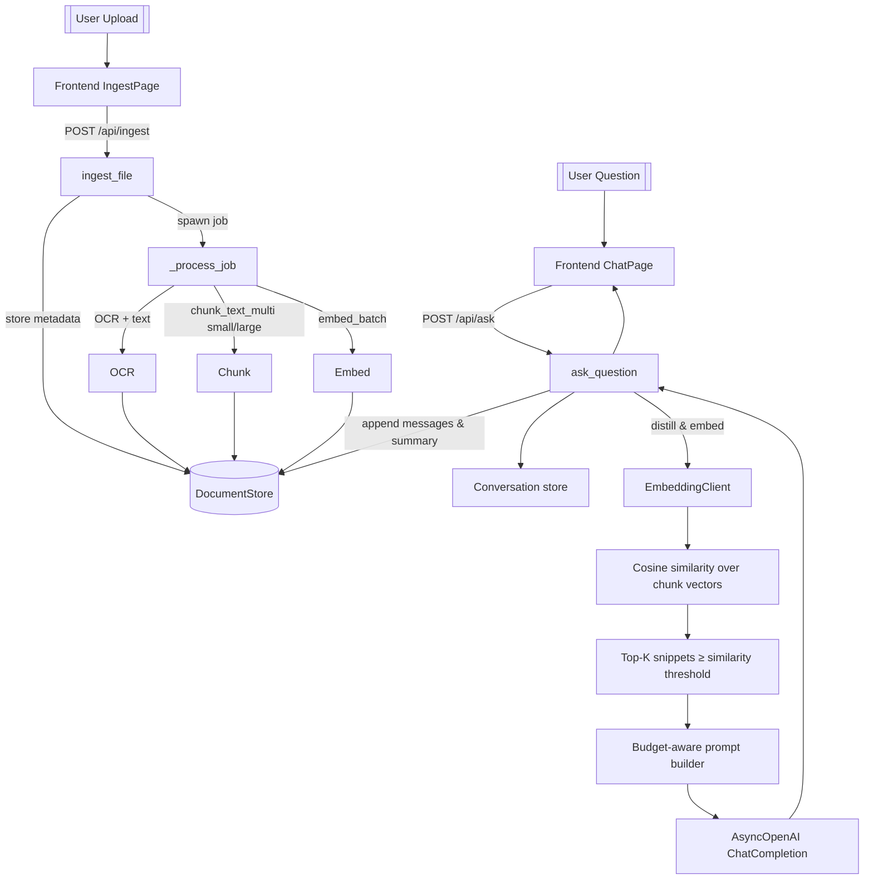

# RAG Architecture Notes

## Pipeline Overview
- `/api/ingest` handles uploads via `ingest_file`, hashes content to dedupe, persists metadata, and enqueues a background job tracked in `jobs_registry`/SQLite (`backend/services/ingestion.py`).
- `_process_job` runs OCR → chunking → embedding with progress callbacks, storing extraction text, chunk rows, embedding vectors, and timing metrics before marking the doc processed (`backend/services/ingestion.py`).
- Chunking uses shared tokenization for "small" and "large" sliding windows defined in `ChunkWindowSpec`, producing hashed chunk IDs and token counts stored via `DocumentStore` (`backend/chunking.py`).
- Embeddings are generated through `EmbeddingClient`, which wraps an OpenAI-compatible API, enforces constant dimensionality, and batch processes chunk text before persisting vectors (`backend/embeddings.py`).
- `DocumentStore` tracks documents, jobs, extractions, chunk configurations, chunks, embeddings, performance metrics, and conversations so both ingestion and chat share state (`backend/persistence.py`).

## Chat Retrieval Flow
- `ask_question` validates queries, ensures at least one processed document, and loads/creates a conversation record before summarizing history and building a distilled query (`backend/services/rag.py`, `backend/utils/conversation.py`).
- The distilled query is embedded once; chunks from all configured window scales are fetched, joined with embeddings, cosine-scored, filtered by `MIN_CONTEXT_SIMILARITY`, and limited to `top_k`≤20 (`backend/services/rag.py`, `backend/utils/vectors.py`).
- Prompt assembly enforces a token budget by trimming history/context/question using estimators from `token_utils`; the final user message inlines retrieved snippets with citation instructions (`backend/services/rag.py`, `backend/token_utils.py`).
- If no snippets remain, the service returns `settings.no_context_response`; otherwise it calls the configured chat completion endpoint, captures the finish reason, and sets `needs_follow_up` when the model didn’t finish naturally (`backend/services/rag.py`).
- Both user and assistant turns are persisted with token counts plus an updated conversation summary, preparing for future continuations and history trimming (`backend/services/rag.py`, `backend/persistence.py`).

## Frontend Touchpoints
- `App.jsx` keeps users on the ingest page until at least one document is processed and no jobs are running; it polls `/api/documents`, `/api/ready`, and `/api/status` for state snapshots.
- `IngestPage.jsx` manages uploads to `/api/ingest`, shows per-file progress, retries, and renders backend settings through `DiagnosticsPanel`, which groups OCR/chunking/embedding/LLM/retrieval/storage parameters.
- `ChatPage.jsx` warms up the LLM (`/api/warmup`), calls `/api/ask`, surfaces context token usage, and offers “continue response” when the backend signals follow-up is needed.

## Mermaid Diagram

