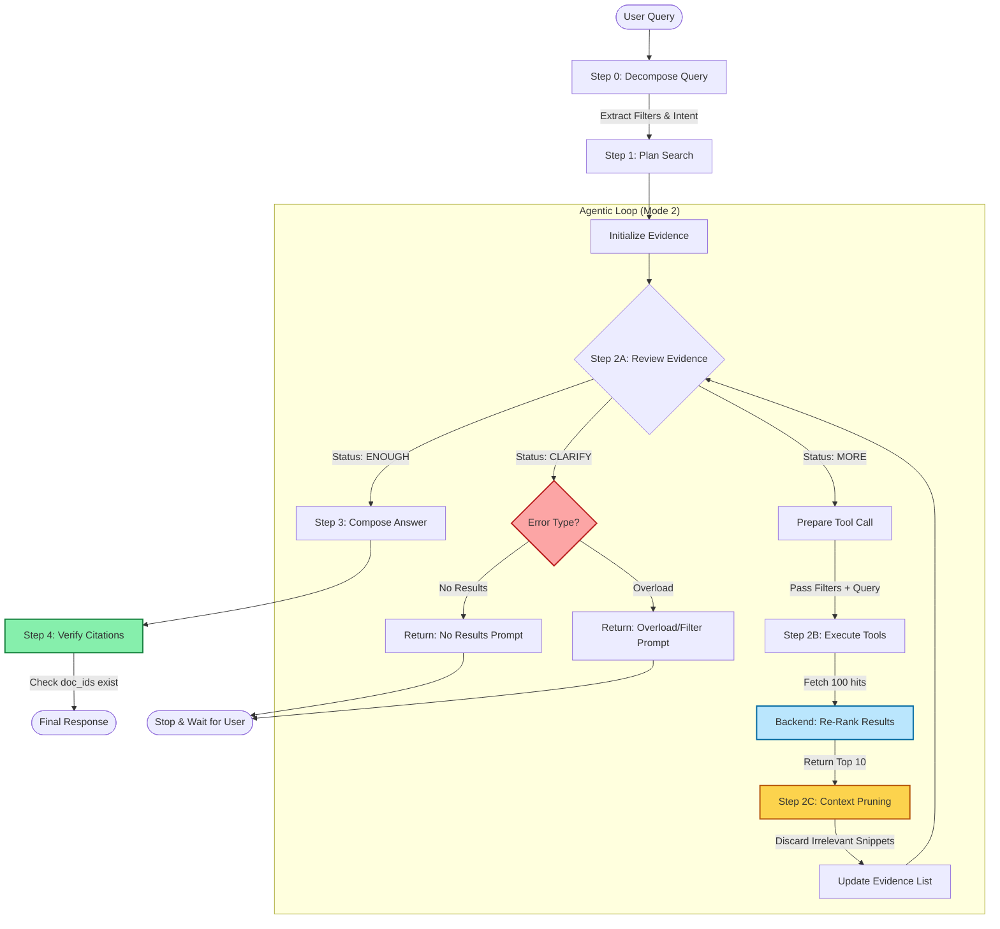
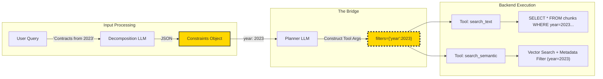
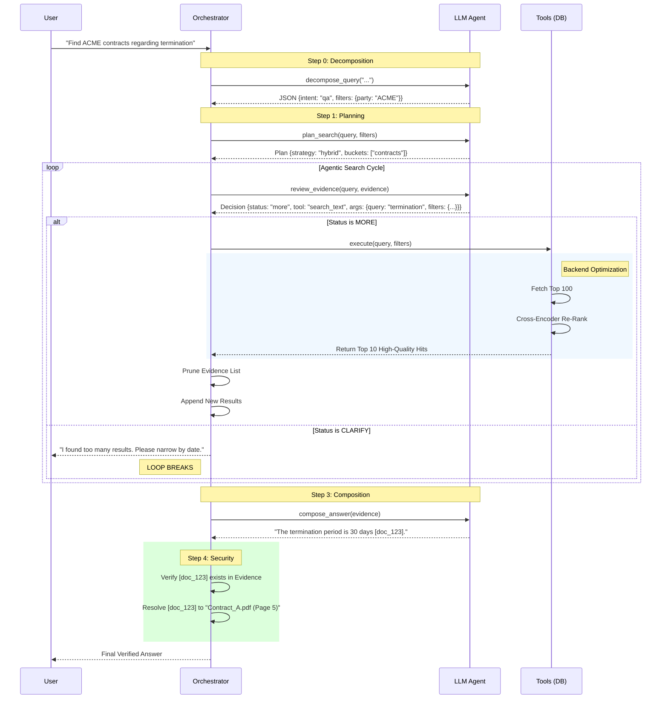

# Agentic RAG Plan for Large Document Corpora

This document describes an **agentic Retrieval-Augmented Generation (RAG)** pattern for searching across large, bucketed document collections (e.g., invoices, datasheets, contracts, certificates).

It is designed for corpora with **100k–1M+ pages**, where:
- Documents are grouped into *buckets* (e.g., `invoices`, `datasheets`, `contracts`, `certificates`, `generic`).
- The LLM acts as an agent that plans searches, refines queries, and composes answers.
- **Key Features:** The system supports structured metadata filtering (`filters`), explicit clarification loops, and context pruning to handle complex constraints and ambiguity.

---

## 1. High-Level Overview

### Goals

- **Agentic Workflow:** The LLM plans, searches, reviews, and answers.
- **Hybrid Capability:** Combines structured filtering (dates, types) with unstructured text/semantic search.
- **Guardrails:** Explicitly manages context window usage and "clarification" states when results are poor or overwhelming.

### Core Components

1. **Indexes / Storage**
   - Pre-chunked text indexed by `bucket`, `doc_id`, `chunk_id`, etc.
   - **Metadata Stores (`document_annotations`):** Stores structured data extracted via the Schema-Driven Extraction Engine. Supports strict filtering (e.g., `year=2023`) via JSON queries.
   - **Re-Ranking (Backend):** Tools internally fetch high-recall sets (e.g., 100 hits) and re-rank them to a low `top_k` (e.g., 5–10) before returning to the LLM.

2. **Search Tools (API-level)**
   - `search_text(bucket, query, filters, top_k, context_chars, doc_id?)`
   - `search_semantic(bucket, query, filters, top_k, context_chars, doc_id?)`
   - `get_document_metadata(doc_id)`

3. **LLM “Agent”**
   - Decides which bucket(s) to search.
   - Chooses search strategy (keyword vs semantic vs hybrid).
   - Calls tools repeatedly, inspects snippets, and stops when it has enough evidence.
   - Composes the final answer from collected snippets with strict citation verification.

4. **Orchestrator (your code)**
   - Wraps calls to the LLM and tools.
   - Enforces max tool calls / limits.
   - Maintains an `evidence` list and performs **Context Pruning** to save tokens.
   - Handles **Clarification** requests from the agent.

---

## 2. Tools Exposed to the LLM

**Note:** Tools now accept a `filters` argument to close the gap between query decomposition and retrieval. Defaults for `top_k` are lowered to prevent context explosion.

### 2.1. `search_text`

- **Purpose**: Keyword/phrase search with optional metadata filtering.
- **Backend Note**: Should use a BM25 or similar keyword index.
- **Filter Note**: `filters` arguments are translated to SQL `WHERE` clauses on the `meta_{bucket}` table.

```jsonc
{
  "name": "search_text",
  "description": "Keyword search within a specific bucket. Supports metadata filtering.",
  "parameters": {
    "type": "object",
    "properties": {
      "bucket": { "type": "string", "description": "Target bucket (e.g., invoices, contracts)." },
      "query": { "type": "string", "description": "Keyword string." },
      "filters": {
        "type": "object",
        "description": "Key-value pairs matching the schema (e.g., {'total_amount': {'>': 1000}}).",
        "additionalProperties": true,
        "nullable": true
      },
      "top_k": { "type": "integer", "default": 10, "description": "Number of snippets to return." },
      "context_chars": { "type": "integer", "default": 400 },
      "doc_id": { "type": "string", "description": "Scope search to a specific document.", "nullable": true }
    },
    "required": ["bucket", "query"]
  }
}
```

### 2.2. `search_semantic`

- **Purpose**: Dense vector retrieval.
- **Backend Note**: Ideally implements a Re-Ranking step (Cross-Encoder) internally to ensure the top 10 results are high quality.

```jsonc
{
  "name": "search_semantic",
  "description": "Semantic/Vector search within a specific bucket. Supports metadata filtering.",
  "parameters": {
    "type": "object",
    "properties": {
      "bucket": { "type": "string" },
      "query": { "type": "string", "description": "Natural language query for embedding." },
      "filters": {
        "type": "object",
        "description": "Metadata filters (e.g., {'device_type': 'NPN'}).",
        "nullable": true
      },
      "top_k": { "type": "integer", "default": 10 },
      "context_chars": { "type": "integer", "default": 500 },
      "doc_id": { "type": "string", "nullable": true }
    },
    "required": ["bucket", "query"]
  }
}
```

### 2.3. `get_document_metadata`

- **Purpose**: Retrieve full metadata for a document (useful when checking if a document meets complex criteria not indexable).

```jsonc
{
  "name": "get_document_metadata",
  "parameters": {
    "type": "object",
    "properties": { "doc_id": { "type": "string" } },
    "required": ["doc_id"]
  }
}
```

---

## 3. Agentic RAG: Three Conceptual Modes

Internally, you can think of the LLM as operating in **three conceptual modes**:

1. `plan_search(query)` – *Planner*
2. `review_evidence(query, plan, evidence)` – *Controller / Critic*
3. `compose_answer(query, evidence)` – *Answerer / Summarizer*

### 3.1. Mode 1 – `plan_search(query)`

**Purpose**: Decide where to search and how.
**Update**: Explicit instructions to use the `filters` argument based on decomposition data.

**System Prompt**:

> You are a search planner.
> Based on the user query, generate a search plan.
>
> 1.  Identify the most relevant `target_buckets`.
> 2.  Determine `strategy`:
>       - "keyword": Specific terms/IDs.
>       - "semantic": Conceptual questions.
>       - "hybrid": You intend to run **both** keyword and semantic searches.
> 3.  Construct `initial_queries`. If the user specifies metadata (dates, companies, types), you MUST plan to pass these as `filters` in your tool calls later.
>
> Output JSON only.

**Example Output**:

```json
{
  "target_buckets": ["contracts"],
  "strategy": "hybrid",
  "initial_queries": ["termination notice"],
  "filters_hint": {"party": "ACME", "year": 2023},
  "max_tool_calls": 4
}
```

### 3.2. Mode 2 – `review_evidence(query, plan, evidence)`

**Purpose**: After each tool call, decide whether we have enough evidence, or whether to search again (and how).
**Update**: Added the `"clarify"` status so the agent isn't forced to hallucinate when results are missing.

**System Prompt**:

> You are the search controller. Review the user query and collected evidence.
> Decide on the next step.
> Output JSON with:
>
>   - `status`: "enough" (ready to answer), "more" (keep searching), or "clarify" (cannot proceed/too many results).
>   - `reason`: Explanation.
>   - `next_tool_call`: Tool definition (if status is "more"). Use `filters` if constraints exist.
>   - `clarification_details`: (if status is "clarify") Object with `type` ("no_results" or "overload") and `missing_info`.

**Example ("More" - Drilling down):**

```json
{
  "status": "more",
  "reason": "Found the contract list, now need the specific PDF content.",
  "next_tool_call": {
    "tool": "search_text",
    "args": {
      "bucket": "contracts",
      "query": "termination clause",
      "filters": {"doc_id": "contract_123"}
    }
  }
}
```

**Example ("Clarify" - No results):**

```json
{
  "status": "clarify",
  "reason": "No datasheets found for 'FluxCapacitor 2000' with the given filters.",
  "clarification_details": {
    "type": "no_results",
    "missing_info": "Check model name or relax year constraint."
  }
}
```

### 3.3. Mode 3 – `compose_answer(query, evidence)`

**Purpose**: Once enough evidence is collected, produce the final answer.
**Update**: Strict citation formatting to prevent ID hallucination.

**System Prompt**:

> Answer the user query using ONLY the provided evidence.
>
>   - **Citations:** You must cite your sources using the format `[doc_id]`. Do NOT make up doc_ids. Copy them exactly from the evidence snippets.
>   - If the evidence is contradictory or incomplete, state that clearly.

---

## 4. Orchestrator Loop

This loop now handles the `clarify` status and includes a **Context Pruning** step (Logic 2b) to prevent the context window from filling up with irrelevant snippets from early search steps.

```python
def agentic_answer(user_query):
    # 0) Pre-computation
    decomposition = llm_decompose_query(user_query) # See Section 8
    
    # 1) Plan
    plan = llm_plan_search(user_query, decomposition)
    evidence = []

    # 2) Iterative search
    for step in range(plan["max_tool_calls"]):
        # A. Review current state
        decision = llm_review_evidence(user_query, plan, evidence)

        # B. Handle Completion
        if decision["status"] == "enough":
            break

        # C. Handle Clarification (Break loop, ask user)
        if decision["status"] == "clarify":
            details = decision["clarification_details"]
            return format_clarification_request(details["type"], details["missing_info"])

        # D. Execute Next Tool
        next_call = decision["next_tool_call"]
        if not next_call: break
        
        raw_results = execute_tool(next_call["tool"], **next_call["args"])

        # E. Context Pruning (Crucial for large searches)
        # Optional: Ask LLM which previous evidence items are irrelevant and remove them
        # or simply append new results and rely on a sliding window if 'raw_results' is small.
        evidence.append({
            "step": step,
            "tool": next_call["tool"],
            "results": raw_results
        })

    # 3) Compose final answer
    final_answer = llm_compose_answer(user_query, evidence)
    
    # 4) Post-process citations (Security)
    # Verify that every [doc_id] in final_answer actually exists in evidence.
    final_answer = verify_citations(final_answer, evidence)
    
    return final_answer
```

---

## 5. Single-Loop Tool-Calling Agent Pattern

An alternative is to let the LLM manage planning, reviewing, and answering **inside a single conversation** with tool-calling enabled.

### 5.1. Sketch of the system prompt

> You are an AI assistant with access to document search tools.  
> Your job is to answer user questions by:  
> 1. Choosing appropriate document buckets (invoices, datasheets, contracts, certificates, generic).  
> 2. Calling search tools to retrieve relevant snippets.  
> 3. Iteratively refining your search until you have enough evidence.  
> 4. Stopping tool calls and returning a final answer.  
>  
> Rules:  
> - Use at most N tool calls per query (e.g., 5).  
> - Prefer narrow searches in the most relevant bucket(s).  
> - After each tool result, decide whether you already have enough information.  
> - Your **final** message to the user must not call tools and must answer the question clearly.  
> - Do not invent facts not supported by snippets. If information is missing, say so.

### 5.2. Single-loop pseudo-code

```python
messages = [system_message, user_message]

for step in range(MAX_STEPS):
    response = llm_with_tools(messages)

    if response.tool_calls:
        # The LLM wants to call a tool
        for call in response.tool_calls:
            result = execute_tool(call.name, **call.arguments)
            # Append the tool result as a message visible to the LLM
            messages.append({
                "role": "tool",
                "name": call.name,
                "content": result
            })
    else:
        # No more tool calls → treat as final answer
        final_answer = response.content
        break

return final_answer
```

---

## 6. Mermaid Diagrams

### 6.1. The Orchestrator Logic Flow

This diagram explicitly visualizes the **Clarification** exit routes, the **Pruning** step to save context, and the **Citation Verification** guardrail.



### 6.2. Data Flow: Passing Constraints to Tools

This diagram illustrates the flow of **structured data** through the system. It shows how constraints (like `year=2023`) extracted during the Decomposition step are passed into the Planner and finally injected into the **Tool arguments** (`filters`). This ensures the backend actually executes the specific search the user asked for.



### 6.3. Sequence Diagram (Timing & Verification)

This sequence shows the life-cycle of a request, including the **Re-ranking** (latency optimization) and **Citation Verification** (hallucination prevention).



---

## 7. Summary

- **Agentic RAG** = LLM actively **drives** retrieval instead of passively accepting a fixed set of chunks.
- You expose **simple, generic tools** (`search_text`, `search_semantic`, etc.) with strict filtering capabilities.
- The Orchestrator manages the conversation state, context window (pruning), and clarification loops.
- This pattern is **domain-agnostic** and robust against ambiguity and hallucination.

---

## 8. Query Decomposition Step (Two-Phase)

For complex user queries (multi-condition, multi-hop, constraints), we use a **Two-Phase Decomposition** strategy to handle schema scalability. We do not dump *all* table schemas into the context window at once.

### Phase 1: The Router
**Goal:** Identify the relevant `target_bucket` (e.g., "invoices") and `intent`.

**Prompt:**
> "User Query: 'Find invoices over $1k from Acme'.
> Available Buckets: [invoices, contracts, datasheets].
> Output: {'bucket': 'invoices', 'intent': 'list'}"

### Phase 2: The Schema Planner
**Goal:** Load the specific schema for the chosen bucket and generate precise filters.

**Input:**
- Query: "Find invoices over $1k from Acme"
- Schema (`meta_invoices`): `[invoice_date (DATE), total_amount (REAL), vendor_name (TEXT)]`

**Output (JSON Plan):**
```json
{
  "filters": {
    "total_amount": { "operator": ">", "value": 1000 },
    "vendor_name": { "operator": "LIKE", "value": "%Acme%" }
  },
  "search_strategy": "hybrid"
}
```

### 8.1. Responsibilities of the Decomposition Step

Given a user query, the LLM pipeline should:

1. **Identify intent**  
   - Is the user asking a direct question, a list, a summary, a comparison, a computation, etc.?

2. **Choose primary buckets (Router)**  
   - Which of your buckets are most relevant: `invoices`, `contracts`, `datasheets`, `certificates`, `generic`, etc.?

3. **Extract entities & constraints (Planner)**  
   - Map natural language to specific Table Columns.
   - Numeric constraints (e.g., `total_amount > 1000`)  
   - Date ranges (e.g., `invoice_date > '2023-01-01'`).

5. **Identify topic terms and subqueries**  
   - Short phrases suitable as search queries for text / semantic search.  
   - Subqueries for different purposes (filtering docs vs. finding specific clauses / properties).

6. **Output preferences**  
   - Does the user want a list, a table, or a natural-language summary?  
   - Should the answer include citations / references?

All of this is represented as a **single JSON object**.

### 8.2. Suggested JSON Schema

Below is a flexible schema you can use as the target format for decomposition:

```jsonc
{
  "intent": "qa | list | summarize | compare | compute",
  "primary_buckets": ["contracts", "invoices", "datasheets", "certificates"],
  "entities": [
    {
      "name": "ACME Corp",
      "role": "company | person | product | chemical | other"
    }
  ],
  "constraints": [
    {
      "field": "invoice_date",
      "operator": ">=",
      "value": "2023-01-01",
      "raw_text": "from 2023"
    },
    {
      "field": "total_amount",
      "operator": ">",
      "value": 1000,
      "raw_text": "over $1k"
    }
  ],
  "topic_terms": [
    "termination notice period"
  ],
  "subqueries": [
    {
      "purpose": "filter_docs",
      "query": "ACME Corp 2023 contract"
    },
    {
      "purpose": "find_clauses",
      "query": "termination notice period"
    }
  ],
  "output_preferences": {
    "format": "natural_language | table | list",
    "needs_citations": true
  }
}
```

### 8.3. Prompt Template for Decomposition

You can implement `decompose_query(query: str) -> dict` with a simple LLM call.

#### System Prompt

```text
You are a query decomposition engine for a large document search system.

Your job is to take a natural-language user query and turn it into a JSON search plan.

You NEVER answer the user’s question.
You NEVER call tools.
You ONLY output one JSON object matching the required schema.

The system has multiple document buckets (e.g. invoices, contracts, datasheets, certificates, generic text).
Your job:
- infer which buckets are most relevant,
- extract entities,
- extract structured constraints (numbers, dates, inequalities),
- propose subqueries that a search engine can run,
- describe how the answer should be returned (list / summary / table, etc.).

If you are unsure about a field, you may omit it.
Do not invent data that is not implied by the query.
```

---

## 9. Example Execution Step Counts

While the precise number of iterations depends on corpus quality and the user question, the decomposition examples above typically translate into the following footprints when the orchestrator enforces a 3–5 tool-call budget:

| Example | Decomposition LLM calls | Plan LLM calls | Review/Control LLM calls* | Tool calls | Compose LLM calls | Notes |
| --- | --- | --- | --- | --- | --- | --- |
| Contracts summary (Section 8.4.1) | 1 | 1 | 3 | 2 | 1 | First review triggers a bucket-wide search, the second drills into the located contract, the third stops once the clause is captured. |
| Transistor list (Section 8.4.2) | 1 | 1 | 4 | 3 | 1 | Extra review/tool step pulls structured specs after initial filtering to populate the requested table. |
| Chemical solvents (Section 8.4.3) | 1 | 1 | 5 | 4 | 1 | Needs multiple bucket hops (datasheets + certificates) before enough evidence exists for each property. |

*Review/Control count includes the final iteration that returns `"enough"` without calling an additional tool. Actual numbers may shrink when documents are well-tagged or expand when the agent must inspect noisy hits.*

---

## 10. Representative Retrieval Use Cases & Clarification Patterns

These scenarios help the Reviewer LLM decide when to trigger a `status: "clarify"`.

### 10.1. No/Low Results (Trigger: 0 hits)

- **Scenario**: The user asks for a specific model year, but no documents match the `year=2024` filter.
- **Agent Action**:
  ```json
  {"status": "clarify", "clarification_details": {"type": "no_results", "missing_info": "No contracts found for 2024."}}
  ```
- **UI Response**: "I looked for contracts in 2024 but found none. Would you like to search all years?"

### 10.2. Result Overload (Trigger: 100+ hits)

- **Scenario**: The user asks "List every invoice", matching thousands of docs.
- **Agent Action**:
  ```json
  {"status": "clarify", "clarification_details": {"type": "overload", "missing_info": "Found 1,200 invoices."}}
  ```
- **UI Response**: "I found 1,200 invoices. Please narrow your search by date or amount, or ask for a CSV export."

### 10.3. Conceptual/manual deep dive (summary → segment vectors)
- **User question**: “Explain the maintenance steps for battery cabinet B-120.”
- **Plan**: Choose the long-text route highlighted in `docs/architecture/rag_workflow.md`: run summary-level semantic search scoped to manual-like buckets, hydrate the top summaries, then drill into segments via local vector search to assemble multi-snippet evidence.
- **Clarification**: When summaries overflow or stay off-topic, describe the relaxation attempts (widened categories, lowered score thresholds) and ask the user to constrain document type, section, or timeframe before retrying.
