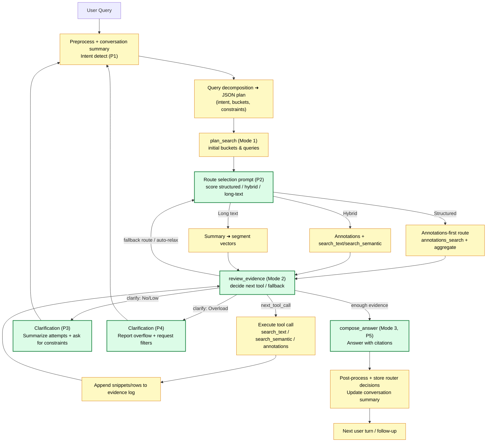
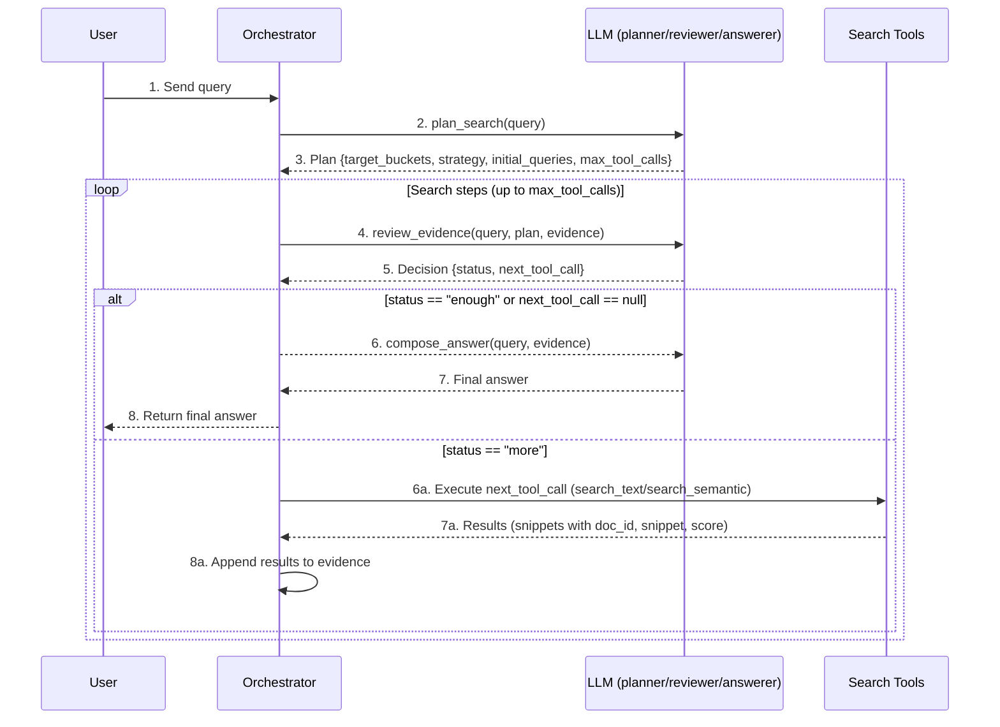
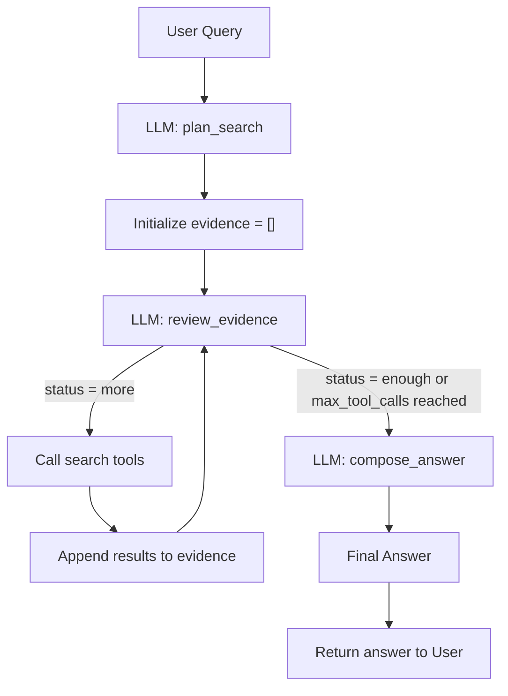
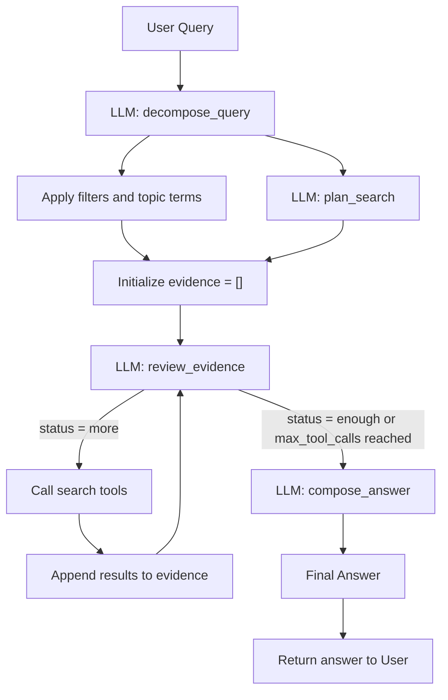

# Agentic RAG Plan for Large Document Corpora

This document describes an **agentic Retrieval-Augmented Generation (RAG)** pattern for searching across large, bucketed document collections (e.g., invoices, datasheets, contracts, certificates) using an LLM that can call search tools.

It’s designed for corpora with **100k–1M+ pages**, where:
- Documents are roughly grouped into *buckets* (e.g., `invoices`, `datasheets`, `contracts`, `certificates`, `generic`).
- You already have parsed text stored in a database / index.
- The LLM can call tools like `search_text` or `search_semantic`, which return snippets around hits.

---

## 1. High-Level Overview

### Goals

- Let the **LLM act as an agent**: it plans how to search, refines queries, inspects results, and then composes an answer.
- Keep the **backend simple**: tools expose basic search functions; indexes do the heavy lifting.
- Make the approach **domain-agnostic**: same logic works for invoices, contracts, datasheets, certificates, etc.

### Core Components

1. **Indexes / Storage**
   - Pre-chunked text for each document.
   - Indexed by `bucket`, `doc_id`, `chunk_id`, etc.
   - Full-text and optionally vector search.

2. **Search Tools (API-level)**
   - `search_text(bucket, query, top_k, context_chars, doc_id?)`
   - `search_semantic(bucket, query, top_k, context_chars, doc_id?)`
   - `get_document_metadata(doc_id)` (optional)

3. **LLM “Agent”**
   - Decides which bucket(s) to search.
   - Chooses search strategy (keyword vs semantic vs hybrid).
   - Calls tools repeatedly, inspects snippets, and stops when it has enough evidence.
   - Composes the final answer from collected snippets.

4. **Orchestrator (your code)**
   - Wraps calls to the LLM and tools.
   - Enforces max tool calls / limits.
   - Maintains an `evidence` list of all tool results.

---

## 2. Tools Exposed to the LLM

These tools are **simple and generic**. The intelligent behavior is in the LLM agent, not in the tools.

### 2.1. `search_text`

- **Purpose**: keyword / phrase search with surrounding context.
- **Example signature**:

```jsonc
{
  "name": "search_text",
  "description": "Keyword/phrase search within a specific bucket of documents.",
  "parameters": {
    "type": "object",
    "properties": {
      "bucket": { "type": "string", "description": "Document bucket (e.g., invoices, contracts, datasheets)." },
      "query": { "type": "string", "description": "Keyword or phrase to search for." },
      "top_k": { "type": "integer", "description": "Max number of snippets to return.", "default": 20 },
      "context_chars": { "type": "integer", "description": "Number of characters of context around each hit.", "default": 400 },
      "doc_id": { "type": "string", "description": "Optional filter to search only within a single document.", "nullable": true }
    },
    "required": ["bucket", "query"]
  }
}
```

- **Return shape (example)**:

```jsonc
{
  "results": [
    {
      "doc_id": "contract_123",
      "chunk_id": "c_005",
      "score": 0.91,
      "snippet": "Either party may terminate this Agreement with thirty (30) days’ prior written notice...",
      "metadata": {
        "page": 12,
        "bucket": "contracts"
      }
    },
    {
      "doc_id": "contract_789",
      "chunk_id": "c_010",
      "score": 0.78,
      "snippet": "The notice period for termination shall be sixty (60) days...",
      "metadata": {
        "page": 5,
        "bucket": "contracts"
      }
    }
  ]
}
```

### 2.2. `search_semantic`

- **Purpose**: semantic search using vector embeddings.
- Signature similar to `search_text`, but query is used for dense retrieval.

```jsonc
{
  "name": "search_semantic",
  "description": "Semantic search within a specific document bucket using embeddings.",
  "parameters": {
    "type": "object",
    "properties": {
      "bucket": { "type": "string" },
      "query": { "type": "string" },
      "top_k": { "type": "integer", "default": 20 },
      "context_chars": { "type": "integer", "default": 500 },
      "doc_id": { "type": "string", "nullable": true }
    },
    "required": ["bucket", "query"]
  }
}
```

### 2.3. `get_document_metadata` (optional but useful)

```jsonc
{
  "name": "get_document_metadata",
  "description": "Retrieve metadata for a given doc_id (e.g., type, date, parties).",
  "parameters": {
    "type": "object",
    "properties": {
      "doc_id": { "type": "string" }
    },
    "required": ["doc_id"]
  }
}
```

---

## 3. Agentic RAG: Three Conceptual Modes

Internally, you can think of the LLM as operating in **three conceptual modes**:

1. `plan_search(query)` – *Planner*
2. `review_evidence(query, plan, evidence)` – *Controller / Critic*
3. `compose_answer(query, evidence)` – *Answerer / Summarizer*

You can implement these as:

- Three separate LLM calls with different system prompts (**orchestrator pattern**), or
- A single tool-calling agent with one system prompt (**single-loop pattern**).

### 3.1. Mode 1 – `plan_search(query)`

**Purpose**: Decide where to search and how.

**System prompt sketch**:

> You are a search planner for a large document system.  
> Do **not** answer the user’s question directly.  
> Based on the user query, choose the most relevant document bucket(s) and initial search queries.  
> Output a **single JSON object** with:  
> - `target_buckets`: array of bucket names  
> - `strategy`: "keyword" | "semantic" | "hybrid"  
> - `initial_queries`: list of search strings to try  
> - `max_tool_calls`: recommended maximum search steps (e.g., 3–5)  
> Do not call tools. Do not answer the question.

**Example output**:

```json
{
  "target_buckets": ["contracts"],
  "strategy": "keyword",
  "initial_queries": [
    "ACME Corp termination notice period",
    "ACME Corp termination clause"
  ],
  "max_tool_calls": 4
}
```

### 3.2. Mode 2 – `review_evidence(query, plan, evidence)`

**Purpose**: After each tool call, decide whether we have enough evidence, or whether to search again (and how).

**Inputs**:

- `query`: original user query
- `plan`: JSON from `plan_search`
- `evidence`: array of past tool calls and results

**System prompt sketch**:

> You control a multi-step search.  
> You see the user query, the initial search plan, and all tool calls and results so far.  
> You do **not** answer the question.  
> Instead, output a JSON object:  
> - `status`: "enough" or "more"  
> - `reason`: short explanation  
> - `next_tool_call`: either `null` or an object:  
>   - `tool`: "search_text" or "search_semantic"  
>   - `args`: arguments for that tool (`bucket`, `query`, `top_k`, `context_chars`, optional `doc_id`)  
> Never output final answers. Never output raw snippets.

**Example output when enough evidence**:

```json
{
  "status": "enough",
  "reason": "We have a clause that clearly states the notice period.",
  "next_tool_call": null
}
```

**Example output when more search is needed**:

```json
{
  "status": "more",
  "reason": "We found the contract but not the exact termination clause yet.",
  "next_tool_call": {
    "tool": "search_text",
    "args": {
      "bucket": "contracts",
      "query": "termination notice",
      "top_k": 10,
      "context_chars": 400,
      "doc_id": "contract_123"
    }
  }
}
```

### 3.3. Mode 3 – `compose_answer(query, evidence)`

**Purpose**: Once enough evidence is collected, produce the final answer.

**Inputs**:

- `query`
- `evidence` (all collected snippets, tool calls, and metadata)

**System prompt sketch**:

> You are a careful assistant that answers **only using the provided evidence**.  
> You receive the user query and a list of search results (snippets) from various documents.  
> Your tasks:  
> - Provide a clear answer to the user.  
> - Quote or paraphrase the most relevant snippets.  
> - If information is incomplete, explicitly say that.  
> - Do **not** invent clauses or numbers. Stick to what is supported by the snippets.  
> - Optionally reference `doc_id` when it helps.  
> Do not call tools.

**Example behavior**:

Given evidence containing:

> `[doc_id=contract_123] "Either party may terminate this Agreement with thirty (30) days’ prior written notice..."`

The LLM responds:

> The contract with ACME Corp specifies a **30 days’ prior written notice** for termination.  
> This comes from document `contract_123`, which states: “Either party may terminate this Agreement with thirty (30) days’ prior written notice…”.

### 3.4. Route Selection Cheat Sheet

Map the query decomposition output (`intent`, `primary_buckets`, `constraints`) into one of the practical routes from `docs/architecture/rag_workflow.md` so the reviewer/controller knows which tools to favor.

| Decomposition signals | Preferred route | Tool bias | Notes |
| --- | --- | --- | --- |
| `intent` = `list` or `compute` + explicit numeric/metadata constraints | Structured / annotations-first | `annotations_search`, `annotations_aggregate`, then fall back to `search_text` if empty | Mirrors the “receipts containing tires” workflow where rows are filtered via `properties.*` before touching long-text search. |
| Mixed constraints, partial annotation coverage, or contradictory signals | Hybrid | Run annotations for whatever coverage exists, then call `search_text` or `search_semantic` in the same bucket | Matches the fallback rules described in the architecture doc’s route-selection section (structured → hybrid → long-text). |
| `intent` = `summarize` or `qa` with no structured fields, manuals-heavy corpora | Long-text | `search_semantic` scoped to summaries, then drill into segments | Aligns with the long-text route that starts at summary vectors before fetching fine-grained snippets. |

Persist the router’s choice and fallback ordering (success/failure, cutoffs) for observability—this mirrors the logging guidance in `docs/architecture/rag_workflow.md` and helps future tuning.

---

## 4. Orchestrator Loop (Multi-Step Pattern)

Here’s how you might implement the orchestrator in pseudo-code:

```python
def agentic_answer(user_query):
    # 1) Plan
    plan = llm_plan_search(user_query)  # Mode 1
    evidence = []

    # 2) Iterative search
    for step in range(plan["max_tool_calls"]):
        decision = llm_review_evidence(user_query, plan, evidence)  # Mode 2

        if decision["status"] == "enough":
            break

        if decision["status"] == "clarify":
            issue = decision["clarification"]
            emit_clarification_prompt(issue["type"], issue["attempts"], issue["reason"])
            return

        next_call = decision["next_tool_call"]
        if not next_call:
            break

        tool = next_call["tool"]
        args = next_call["args"]

        # Execute the actual tool (your backend implementation)
        result = execute_tool(tool, **args)

        # Append to evidence
        evidence.append({
            "tool": tool,
            "args": args,
            "results": result
        })

    # 3) Compose final answer
    final_answer = llm_compose_answer(user_query, evidence)  # Mode 3
    return final_answer
```

This gives you **fine-grained control** and observability:
- You can log `plan`, `evidence`, decisions, etc.
- You can enforce strict limits on tools / buckets.
- When `llm_review_evidence` signals a clarification (No/Low Results vs Result Overload), call the corresponding templates from Section 10 so the user understands what failed before narrowing their request.

### 4.1. Comprehensive Workflow Diagram

A single diagram now combines preprocessing, decomposition, route scoring, iterative search, clarification prompts, and answer generation with the prompt markers `(P1–P5)` used throughout this doc.



---

## 5. Single-Loop Tool-Calling Agent Pattern

An alternative is to let the LLM manage planning, reviewing, and answering **inside a single conversation** with tool-calling enabled.

### 5.1. Sketch of the system prompt

> You are an AI assistant with access to document search tools.  
> Your job is to answer user questions by:  
> 1. Choosing appropriate document buckets (invoices, datasheets, contracts, certificates, generic).  
> 2. Calling search tools to retrieve relevant snippets.  
> 3. Iteratively refining your search until you have enough evidence.  
> 4. Stopping tool calls and returning a final answer.  
>  
> Rules:  
> - Use at most N tool calls per query (e.g., 5).  
> - Prefer narrow searches in the most relevant bucket(s).  
> - After each tool result, decide whether you already have enough information.  
> - Your **final** message to the user must not call tools and must answer the question clearly.  
> - Do not invent facts not supported by snippets. If information is missing, say so.

### 5.2. Single-loop pseudo-code

```python
messages = [system_message, user_message]

for step in range(MAX_STEPS):
    response = llm_with_tools(messages)

    if response.tool_calls:
        # The LLM wants to call a tool
        for call in response.tool_calls:
            result = execute_tool(call.name, **call.arguments)
            # Append the tool result as a message visible to the LLM
            messages.append({
                "role": "tool",
                "name": call.name,
                "content": result
            })
    else:
        # No more tool calls → treat as final answer
        final_answer = response.content
        break

return final_answer
```

This is simpler to wire up but gives you less explicit separation between planning, reviewing, and answering.

---

## 6. Mermaid Diagram of the Agentic RAG Flow

Below is a detailed **sequence diagram** showing the orchestrator-style flow from user query to final answer.



And a **flowchart view** of the same process:



### 6.1. Flow with Query Decomposition

Query decomposition becomes the first explicit step in the loop: it normalizes the user request, proposes filters, and feeds the planner with well-formed search hints. The diagram below extends the earlier flowchart to show where the `decompose_query` call sits relative to planning, retrieval, and answering.



---

## 7. Summary

- **Agentic RAG** = LLM actively **drives** retrieval instead of passively accepting a fixed set of chunks.
- You expose **simple, generic tools** (`search_text`, `search_semantic`, etc.), while your indexes handle the hard scaling problem.
- You can implement the agent as:
  - An **orchestrator pattern** with three conceptual modes (`plan_search`, `review_evidence`, `compose_answer`), or
  - A **single-loop tool-calling agent** with one system prompt and iterative tool calls.
- This pattern is **domain-agnostic** and works for invoices, contracts, datasheets, certificates, and any other parsed text buckets you have.

You can now plug this markdown specification into your project as documentation or as a design reference for implementing the actual agent and tools.


---

## 8. Query Decomposition Step (Critical for Complex Prompts)

For complex user queries (multi-condition, multi-hop, constraints), it is extremely useful to add an explicit **query decomposition step** *before* the agent starts calling search tools or vector indexes.

This step turns a natural-language query into a **structured JSON plan** that downstream logic (and the agent itself) can use to:

- Decide which buckets to search.
- Apply metadata/structured filters.
- Form good sub-queries for full-text and semantic search.
- Choose an appropriate output format (list, table, summary, etc.).

> **Conversation hygiene reminder**  
> Carry forward a compact (≤400 token) rolling conversation summary and honor explicit “new topic” resets before invoking decomposition, as described in `docs/architecture/rag_workflow.md`. This keeps pronoun resolution accurate and prevents the planner from inheriting stale constraints.

### 8.1. Responsibilities of the Decomposition Step

Given a user query, the LLM should:

1. **Identify intent**  
   - Is the user asking a direct question, a list, a summary, a comparison, a computation, etc.?

2. **Choose primary buckets**  
   - Which of your buckets are most relevant: `invoices`, `contracts`, `datasheets`, `certificates`, `generic`, etc.?

3. **Extract entities**  
   - Companies (e.g., “ACME Corp”), people, products, chemicals, etc.

4. **Extract constraints**  
   - Metadata-style constraints (e.g., `year = 2023`, `party = ACME`)  
   - Numeric constraints (e.g., `boiling_point_c > 150`)  
   - Inequalities or ranges (e.g., `termination_notice_days < 60`).  

5. **Identify topic terms and subqueries**  
   - Short phrases suitable as search queries for text / semantic search.  
   - Subqueries for different purposes (filtering docs vs. finding specific clauses / properties).

6. **Output preferences**  
   - Does the user want a list, a table, or a natural-language summary?  
   - Should the answer include citations / references?

All of this is represented as a **single JSON object**.

### 8.2. Suggested JSON Schema

Below is a flexible schema you can use as the target format for decomposition:

```jsonc
{
  "intent": "qa | list | summarize | compare | compute",
  "primary_buckets": ["contracts", "invoices", "datasheets", "certificates"],
  "entities": [
    {
      "name": "ACME Corp",
      "role": "company | person | product | chemical | other"
    }
  ],
  "constraints": [
    {
      "field": "year",
      "operator": "=",
      "value": 2023,
      "raw_text": "2023"
    },
    {
      "field": "termination_notice_days",
      "operator": "<",
      "value": 60,
      "raw_text": "under 60 days"
    }
  ],
  "topic_terms": [
    "termination notice period"
  ],
  "subqueries": [
    {
      "purpose": "filter_docs",
      "query": "ACME Corp 2023 contract"
    },
    {
      "purpose": "find_clauses",
      "query": "termination notice period"
    }
  ],
  "output_preferences": {
    "format": "natural_language | table | list",
    "needs_citations": true
  }
}
```

Notes:

- `field` names don’t have to be perfect; you can later map them onto your actual schema.
- `operator` can be `"="`, `">"`, `"<"`, `">="`, `"<="`, `"in"`, `"between"`, or domain-specific strings (`"high"`, etc.).
- `raw_text` preserves the exact text from the query that produced this constraint, useful for debugging and mapping.

### 8.3. Prompt Template for Decomposition

You can implement `decompose_query(query: str) -> dict` with a simple LLM call.

#### System Prompt

```text
You are a query decomposition engine for a large document search system.

Your job is to take a natural-language user query and turn it into a JSON search plan.

You NEVER answer the user’s question.
You NEVER call tools.
You ONLY output one JSON object matching the required schema.

The system has multiple document buckets (e.g. invoices, contracts, datasheets, certificates, generic text).
Your job:
- infer which buckets are most relevant,
- extract entities,
- extract structured constraints (numbers, dates, inequalities),
- propose subqueries that a search engine can run,
- describe how the answer should be returned (list / summary / table, etc.).

If you are unsure about a field, you may omit it.
Do not invent data that is not implied by the query.
```

#### User Message Template

```text
User query:
"{USER_QUERY}"

Available buckets:
- invoices
- contracts
- datasheets
- certificates
- generic

Output a single JSON object with the following keys:

- intent: "qa" | "list" | "summarize" | "compare" | "compute"
- primary_buckets: array of bucket names (strings)
- entities: array of { "name": string, "role": string }
- constraints: array of {
    "field": string,
    "operator": string,
    "value": string or number,
    "raw_text": string
  }
- topic_terms: array of short phrases that capture the main topic
- subqueries: array of {
    "purpose": string,
    "query": string
  }
- output_preferences: {
    "format": "natural_language" | "table" | "list",
    "needs_citations": boolean
  }

Only output JSON. No explanations, no comments.
```

You simply replace `{USER_QUERY}` with the actual user query in your code.

### 8.4. Examples of Decomposition

#### 8.4.1. Contracts Example

**User query**

> Summarize all 2023 contracts we have with ACME Corp where the termination notice period is under 60 days.

**Decomposition Output**

```json
{
  "intent": "summarize",
  "primary_buckets": ["contracts"],
  "entities": [
    {
      "name": "ACME Corp",
      "role": "company"
    }
  ],
  "constraints": [
    {
      "field": "party",
      "operator": "=",
      "value": "ACME Corp",
      "raw_text": "ACME Corp"
    },
    {
      "field": "year",
      "operator": "=",
      "value": 2023,
      "raw_text": "2023"
    },
    {
      "field": "termination_notice_days",
      "operator": "<",
      "value": 60,
      "raw_text": "under 60 days"
    }
  ],
  "topic_terms": [
    "termination notice period",
    "contract summary"
  ],
  "subqueries": [
    {
      "purpose": "filter_docs",
      "query": "ACME Corp 2023 contract"
    },
    {
      "purpose": "find_clauses",
      "query": "termination notice period"
    }
  ],
  "output_preferences": {
    "format": "natural_language",
    "needs_citations": true
  }
}
```

How this is used downstream:

- `primary_buckets` → choose the `contracts` bucket.
- `constraints` → metadata filters (party/year) and internal field mapping.
- `subqueries` → initial text/semantic search queries over contract text.
- `intent` + `output_preferences` → agent knows the final output should be a natural-language summary with citations.

---

#### 8.4.2. Transistor / Datasheet Example

**User query**

> List 1W NPN transistors in TO-220 package with Vceo at least 50V.

**Decomposition Output**

```json
{
  "intent": "list",
  "primary_buckets": ["datasheets"],
  "entities": [],
  "constraints": [
    {
      "field": "device_type",
      "operator": "=",
      "value": "NPN transistor",
      "raw_text": "NPN transistors"
    },
    {
      "field": "power_w",
      "operator": ">=",
      "value": 1.0,
      "raw_text": "1W"
    },
    {
      "field": "package",
      "operator": "=",
      "value": "TO-220",
      "raw_text": "TO-220"
    },
    {
      "field": "vceo_v",
      "operator": ">=",
      "value": 50.0,
      "raw_text": "at least 50V"
    }
  ],
  "topic_terms": [
    "power transistor",
    "1W NPN",
    "TO-220",
    "Vceo >= 50V"
  ],
  "subqueries": [
    {
      "purpose": "filter_docs",
      "query": "NPN transistor TO-220 1W"
    },
    {
      "purpose": "find_specs",
      "query": "Vceo power dissipation"
    }
  ],
  "output_preferences": {
    "format": "table",
    "needs_citations": false
  }
}
```

Downstream usage:

- `constraints` → structured filters on your datasheet property table (power, package, Vceo).
- `topic_terms` / `subqueries` → semantic search over 200-token chunks to retrieve spec lines.
- `output_preferences.format = "table"` → final answer is rendered as a table of parts + specs.

---

#### 8.4.3. Chemical Example

**User query**

> Find organic solvents with boiling point above 150°C that are highly soluble in water and have low toxicity.

**Decomposition Output**

```json
{
  "intent": "list",
  "primary_buckets": ["datasheets", "certificates"],
  "entities": [],
  "constraints": [
    {
      "field": "is_organic",
      "operator": "=",
      "value": true,
      "raw_text": "organic solvents"
    },
    {
      "field": "boiling_point_c",
      "operator": ">",
      "value": 150,
      "raw_text": "above 150°C"
    },
    {
      "field": "solubility_water",
      "operator": "high",
      "value": null,
      "raw_text": "highly soluble in water"
    },
    {
      "field": "toxicity",
      "operator": "in",
      "value": ["low", "very_low"],
      "raw_text": "low toxicity"
    }
  ],
  "topic_terms": [
    "organic solvent",
    "high water solubility",
    "low toxicity",
    "boiling point above 150°C"
  ],
  "subqueries": [
    {
      "purpose": "filter_docs",
      "query": "organic solvent data sheet"
    },
    {
      "purpose": "find_properties",
      "query": "boiling point water solubility toxicity"
    }
  ],
  "output_preferences": {
    "format": "table",
    "needs_citations": true
  }
}
```

Usage:

- `constraints` drive structured filtering (organic=true, boiling_point_c>150, toxicity low).
- `subqueries` drive text/semantic search on property tables or narrative descriptions.
- `format="table"` → you know to output a table of compounds + properties.

### 8.5. Where Decomposition Fits in the Full Agentic Flow

In the full pipeline, the query decomposition step typically comes **before** planning and retrieval:

1. **Decompose Query**  
   - Call `decompose_query(query)` with the prompts above.  
   - Get a JSON object with `intent`, `primary_buckets`, `constraints`, `subqueries`, etc.

2. **Plan Search (Section 3 / Section 4)**  
   - Use `primary_buckets` from the decomposition as the starting point.  
   - Use `topic_terms` / `subqueries` to initialize the `plan_search` step or the first tool calls.

3. **Agentic Iterative Retrieval**  
   - LLM (planner/controller) uses constraints and subqueries to:
     - call metadata filters,
     - call `search_text` / `search_semantic` on your 200-token chunk index,
     - refine queries based on results.

4. **Answer Composition**  
   - LLM uses the evidence and the original `intent` + `output_preferences` from decomposition to craft the final answer (summary, list, table, etc.).

You can think of `decompose_query` as a **front-end normalizer** that makes all subsequent logic cleaner and easier to reason about, especially when queries become long and complex.


---

## 9. Example Execution Step Counts

While the precise number of iterations depends on corpus quality and the user question, the decomposition examples above typically translate into the following footprints when the orchestrator enforces a 3–5 tool-call budget:

| Example | Decomposition LLM calls | Plan LLM calls | Review/Control LLM calls* | Tool calls | Compose LLM calls | Notes |
| --- | --- | --- | --- | --- | --- | --- |
| Contracts summary (Section 8.4.1) | 1 | 1 | 3 | 2 | 1 | First review triggers a bucket-wide search, the second drills into the located contract, the third stops once the clause is captured. |
| Transistor list (Section 8.4.2) | 1 | 1 | 4 | 3 | 1 | Extra review/tool step pulls structured specs after initial filtering to populate the requested table. |
| Chemical solvents (Section 8.4.3) | 1 | 1 | 5 | 4 | 1 | Needs multiple bucket hops (datasheets + certificates) before enough evidence exists for each property. |

*Review/Control count includes the final iteration that returns `"enough"` without calling an additional tool. Actual numbers may shrink when documents are well-tagged or expand when the agent must inspect noisy hits.*

---

## 10. Representative Retrieval Use Cases & Clarification Patterns

These scenarios originate from `docs/architecture/rag_workflow.md` and now live here so the new plan captures the rich examples from the earlier workflow write-up.

### 10.1. Structured enumeration (annotations-first)
- **User question**: “List every tire purchase receipt.”
- **Plan**: Detect enumeration intent + structured filters, select the annotations route, and run `annotations_search` with predicates such as `properties.item_desc~"tire"` and constrained date ranges for the `invoices`/`receipts` bucket. Call `search_text` only if structured coverage is exhausted.
- **Clarification**: When matches exceed snippet/table limits (the architecture doc cites 1,042 hits), trigger the **Result Overload** prompt so the user can narrow by vendor, timeframe, or quantity, or request CSV export.

### 10.2. Numeric lookup (key-value annotations)
- **User question**: “What is the minimum panel width for AlphaSolar models?”
- **Plan**: Stick to the structured bucket, search annotation labels that are lexically or semantically close to “width/height”, and apply numeric filters on stored values. Summaries/vector search become a fallback only if the annotations route produces zero evidence.
- **Clarification**: If both the key-value lookup and the summary-vector check return nothing, emit the **No/Low Results** prompt that lists the attempted filters plus suggestions (alternate model names, acceptable ranges, upload date filters).

### 10.3. Conceptual/manual deep dive (summary → segment vectors)
- **User question**: “Explain the maintenance steps for battery cabinet B-120.”
- **Plan**: Choose the long-text route highlighted in `docs/architecture/rag_workflow.md`: run summary-level semantic search scoped to manual-like buckets, hydrate the top summaries, then drill into segments via local vector search to assemble multi-snippet evidence.
- **Clarification**: When summaries overflow or stay off-topic, describe the relaxation attempts (widened categories, lowered score thresholds) and ask the user to constrain document type, section, or timeframe before retrying.

### 10.4. Clarification prompt templates (No/Low vs Result Overload)
- **No/Low Results**:
  - System message: “Retrieval cannot proceed with the current scope (Reason: {{reason_summary}}). Summarize what was tried and ask for targeted clarification.”
  - Include the original question, every attempted tool/filter combo with match counts, and a short list of intent-specific hints (alternate terms, IDs, acceptable ranges). Offer example follow-ups such as “search all documents” or “switch to text search.”
- **Result Overload**:
  - System message: “Retrieval produced too many matches to summarize (Reason: {{reason_summary}}). Summarize what was tried and ask for targeted filters.”
  - List each attempt with match counts vs limits, state where overflow results are stored, and nudge the user toward filters like vendor/date/quantity thresholds or export requests (e.g., “filter to 2024 only”, “export full CSV”).

Reuse these templates directly when the reviewer loop emits a `clarify` decision (Section 4), so users always understand why the agent paused and what inputs will unblock the next retrieval pass.
