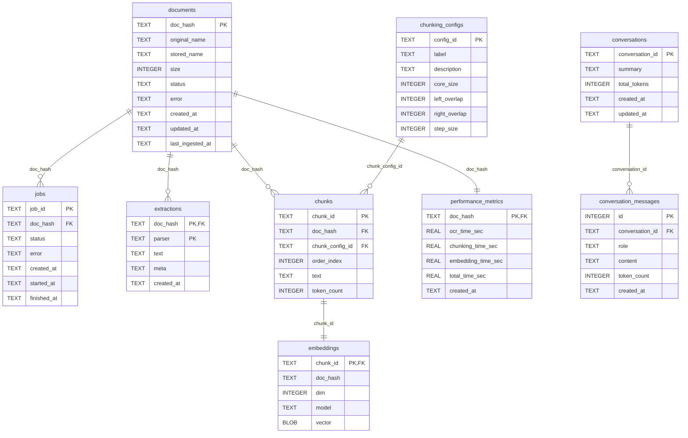

# Database Tables

The `DocumentStore` component (`backend/persistence.py`) provisions an on-disk SQLite schema that keeps track of document ingestion, chunking, embeddings, and chat conversations. This page captures the latest schema so you can explore relationships quickly.

## Schema overview

## Table details

### documents

Canonical record for each uploaded file, keyed by a content hash so deduplication is automatic.

| Column | Type | Keys & constraints |
| --- | --- | --- |
| `doc_hash` | TEXT | Primary key; stored hash of the raw file contents. |
| `original_name` | TEXT | Original filename from the uploader. |
| `stored_name` | TEXT | On-disk filename inside `DATA_DIR`. |
| `size` | INTEGER | File size in bytes. |
| `status` | TEXT | Current ingestion status (`pending`, `processed`, `error`, etc.). |
| `error` | TEXT | Error string captured when ingestion fails. |
| `created_at` | TEXT | ISO timestamp when the row was first created. |
| `updated_at` | TEXT | ISO timestamp for the latest mutation. |
| `last_ingested_at` | TEXT | ISO timestamp when the document was last fully ingested. |

**Indexes**

- `idx_docs_status` accelerates dashboard filtering by status.

**Linked tables**

- Referenced by `[jobs](#jobs)`, `[extractions](#extractions)`, `[chunks](#chunks)`, and `[performance_metrics](#performance_metrics)`.

### jobs

Tracks asynchronous ingestion work for each document.

| Column | Type | Keys & constraints |
| --- | --- | --- |
| `job_id` | TEXT | Primary key for the async job. |
| `doc_hash` | TEXT | Foreign key to [`documents`](#documents); cascade deletes keep the queue clean. |
| `status` | TEXT | `queued`, `running`, `completed`, `failed`, etc. |
| `error` | TEXT | If populated, explains why the job failed. |
| `created_at` | TEXT | Enqueue timestamp. |
| `started_at` | TEXT | First worker start timestamp. |
| `finished_at` | TEXT | Completion timestamp. |

### extractions

Stores parser-specific raw text and metadata produced during OCR/parsing.

| Column | Type | Keys & constraints |
| --- | --- | --- |
| `doc_hash` | TEXT | Part of the composite primary key; foreign key to [`documents`](#documents). |
| `parser` | TEXT | Part of the composite primary key; names the parser variant (e.g., `mineru`). |
| `text` | TEXT | Extracted document text. |
| `meta` | TEXT | JSON metadata string (layout info, parser stats, etc.). |
| `created_at` | TEXT | When this parser output was last refreshed. |

**Indexes**

- `idx_ext_doc` supports quick lookups by `doc_hash`.

### chunking_configs

Defines the sliding-window presets used during chunking. Each config captures the window core size plus overlaps so downstream consumers can tell exactly how a chunk was produced.

| Column | Type | Keys & constraints |
| --- | --- | --- |
| `config_id` | TEXT | Primary key (e.g., `chunk-small`). |
| `label` | TEXT | Friendly name shown in diagnostics. |
| `description` | TEXT | Optional human-readable summary. |
| `core_size` | INTEGER | Number of tokens in the center window. |
| `left_overlap` | INTEGER | Tokens included before the core window. |
| `right_overlap` | INTEGER | Tokens included after the core window. |
| `step_size` | INTEGER | Sliding-step in tokens for the next window. |

The startup sequence syncs the configured presets (small + large) into this table so foreign keys can reference them.

### chunks

Holds ordered text snippets that feed embedding generation and retrieval.

| Column | Type | Keys & constraints |
| --- | --- | --- |
| `chunk_id` | TEXT | Primary key. |
| `doc_hash` | TEXT | Foreign key to [`documents`](#documents). |
| `chunk_config_id` | TEXT | Foreign key to [`chunking_configs`](#chunking_configs); identifies which window preset produced the row. |
| `order_index` | INTEGER | Maintains the original layout order. |
| `text` | TEXT | Chunk contents. |
| `token_count` | INTEGER | Tokenized length (used for window sizing and metrics). |

**Indexes**

- `idx_chunks_doc` speeds up chunk scans per document.
- `idx_chunks_config` enables quick grouping/filtering by configuration.

### embeddings

Vector store for each chunk. Vectors are stored as packed float32 blobs, and each embedding row is deleted automatically when its chunk disappears.

| Column | Type | Keys & constraints |
| --- | --- | --- |
| `chunk_id` | TEXT | Primary key and foreign key to [`chunks`](#chunks). |
| `doc_hash` | TEXT | Denormalized copy of the owning document hash (not enforced by FK, but kept in sync by the service). |
| `dim` | INTEGER | Embedding dimensionality. |
| `model` | TEXT | Model identifier (e.g., `text-embedding-3-large`). |
| `vector` | BLOB | Packed float32 array. |

**Indexes**

- `idx_emb_doc` is used when counting vectors per document.

### performance_metrics

One row per document summarizing ingestion timings.

| Column | Type | Keys & constraints |
| --- | --- | --- |
| `doc_hash` | TEXT | Primary key and foreign key to [`documents`](#documents). |
| `ocr_time_sec` | REAL | OCR duration. |
| `chunking_time_sec` | REAL | Time spent chunking. |
| `embedding_time_sec` | REAL | Time taken to embed all chunks. |
| `total_time_sec` | REAL | Wall-clock from job start to finish. |
| `created_at` | TEXT | When the metric snapshot was recorded. |

**Indexes**

- `idx_perf_doc` duplicates the primary key for quick `doc_hash` probing.

### conversations

High-level record for every chat thread in the UI.

| Column | Type | Keys & constraints |
| --- | --- | --- |
| `conversation_id` | TEXT | Primary key. |
| `summary` | TEXT | Rolling abstractive summary of the chat (used for context compression). |
| `total_tokens` | INTEGER | Running total that is incremented per message. |
| `created_at` | TEXT | Creation timestamp. |
| `updated_at` | TEXT | Timestamp of the last message/summary update. |

### conversation_messages

Individual chat messages plus their token counts; deleting a conversation cascades to its messages.

| Column | Type | Keys & constraints |
| --- | --- | --- |
| `id` | INTEGER | Primary key (`AUTOINCREMENT`). |
| `conversation_id` | TEXT | Foreign key to [`conversations`](#conversations). |
| `role` | TEXT | Message role (`user`, `assistant`, `system`, etc.). |
| `content` | TEXT | Message body. |
| `token_count` | INTEGER | Count used to update the parent's `total_tokens`. |
| `created_at` | TEXT | Message timestamp. |

**Indexes**

- `idx_conv_msgs_conv` (`conversation_id`, `id`) allows fetching ordered transcripts efficiently.
