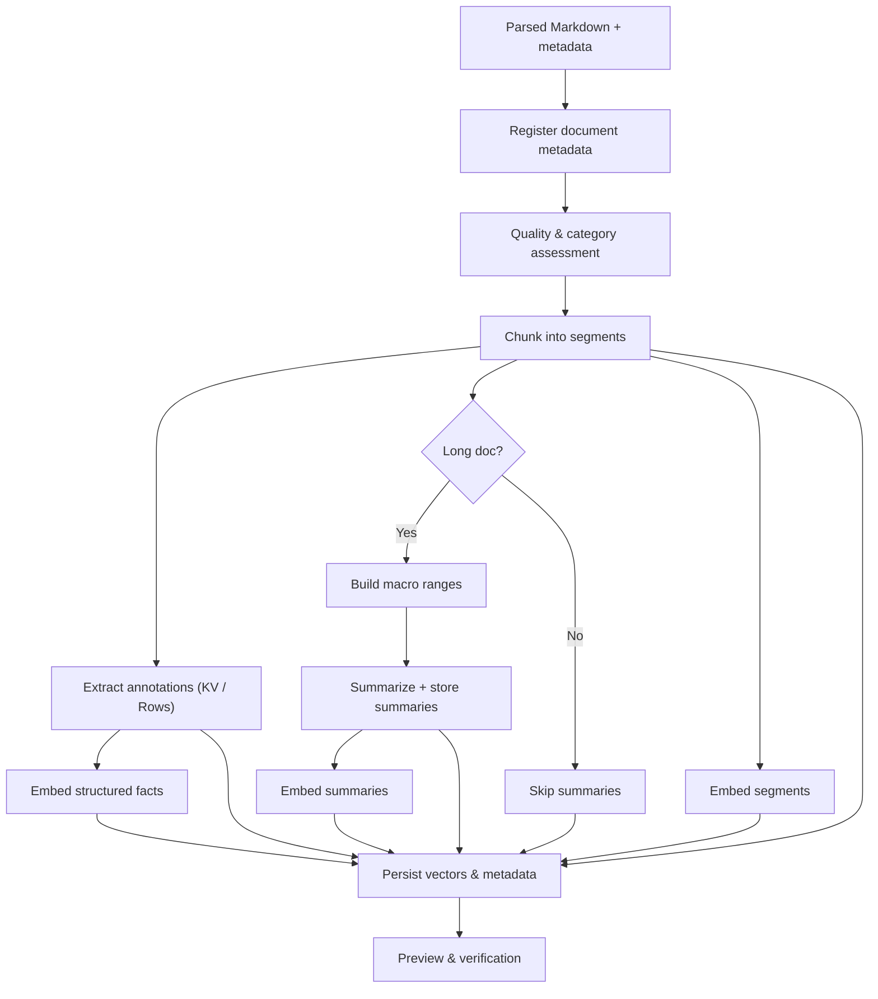

# Ingestion Workflow

This document describes the end-to-end ingestion pipeline starting from a parsed Markdown document (already extracted from OCR/PDF) and ending with indexed assets (segments, summaries, annotations, embeddings, metadata) ready for retrieval.

## 1. Inputs & Assumptions
- Parsed Markdown text + metadata (doc_id, original filename, byte size).
- Token estimate of the full text (using tokenizer or char→token heuristic).
- Storage services: document store, segment store, annotation store, embedding store.
- Config knobs: chunk size/overlap, macro summary size, extractors enabled, timeout budgets (GPU is always available).

## 2. Workflow Overview
1. **Document Registration**
   - Persist document metadata (hash, filename, size, parser info, category hints if provided).
   - Record source path and ingestion timestamps.

2. **Quality & Category Assessment**
   - Compute basic stats: token count, page count, average line length, table density.
   - Classify document category (e.g., long text, short form, data-heavy) using heuristics:
     - High table/colon density → data-heavy form.
     - Long continuous paragraphs → long text.
     - Mixed indicators → mark as hybrid.
   - Store category hints in document metadata.

3. **Segmentation**
   - Tokenize text and run sliding window chunking (size ≈ 500 tokens, overlap ≈ 100).
   - Normalize whitespace, retain headings/context.
   - Assign deterministic chunk IDs (hash of content + doc_id).
   - Persist segments with order index, token count, and provenance (e.g., paragraph anchor).

4. **Annotation Extraction**
   - Run pattern extractors over Markdown to produce two annotation shapes:
     - **Key-Value facts**: detect `Label: value`, header-value pairs, numeric specs.
     - **Rows**: parse markdown tables or bullet lists with consistent delimiters.
   - Normalize numeric values (value_num, unit), dates, currency codes as available.
   - Attach provenance: segment_id, character offsets, page indices if known.
   - Persist annotations + typed props for filtering.

5. **Summary Generation (for long docs)**
   - If doc classified as long text and token count > threshold:
     - Create macro ranges (~10–20k tokens) by grouping consecutive segments.
     - Prompt local LLM to summarize each macro range and assign an optional topic label.
     - Store summary text plus its macro span indices.

6. **Embedding Creation**
   - Segments: batch through embedding model; store vectors with target_kind="segment".
   - Summaries (if any): embed summary texts; target_kind="summary".
   - Structured facts: optionally embed annotation text (serialized key/value or row) when they are frequently retrieved semantically; target_kind="annotation".
   - Handle dimensionality consistency checks.

7. **Index & Metrics Persistence**
   - Upsert chunks, annotations, summaries, embeddings into the document store.
   - Compute ingestion metrics (time spent in parsing, chunking, annotation extraction, embedding) for monitoring.
   - Mark document status = processed when all assets succeed.

8. **Verification & Preview**
   - Generate quick preview (first N chars) for UI debugging endpoints.
   - Optionally run sample queries (e.g., search annotations for totals) to ensure coverage.

## 3. Mermaid Diagram

## 4. Key Extractor Notes
- Key-value extractor should handle variations like `Label - value`, tables with two columns, and bolded headings.
- Row extractor needs schema inference: use header row to name columns; fallback to generic column names when absent.
- Numeric normalization stores both raw text and parsed numbers/units to support precise filtering while preserving fidelity.

## 5. Failure & Retry Handling
- Any stage error should update document status to `error` with message + allow retry.
- Partial assets (segments, annotations, embeddings) should be rolled back or replaced on retry to avoid duplicates.
- Background jobs (OCR, summaries, embeddings) must respect timeout budgets and log GPU/CPU usage.
