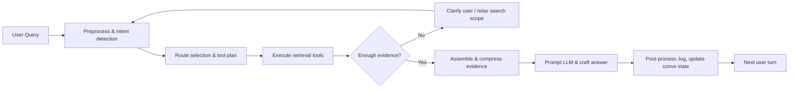
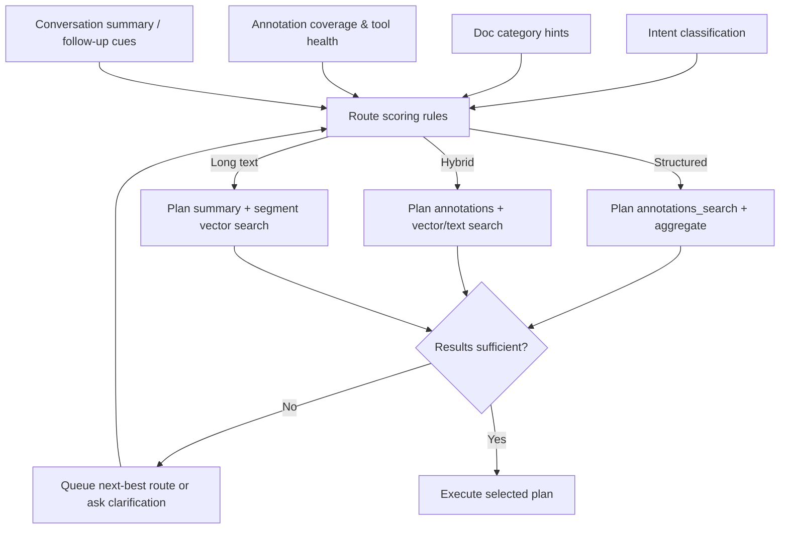
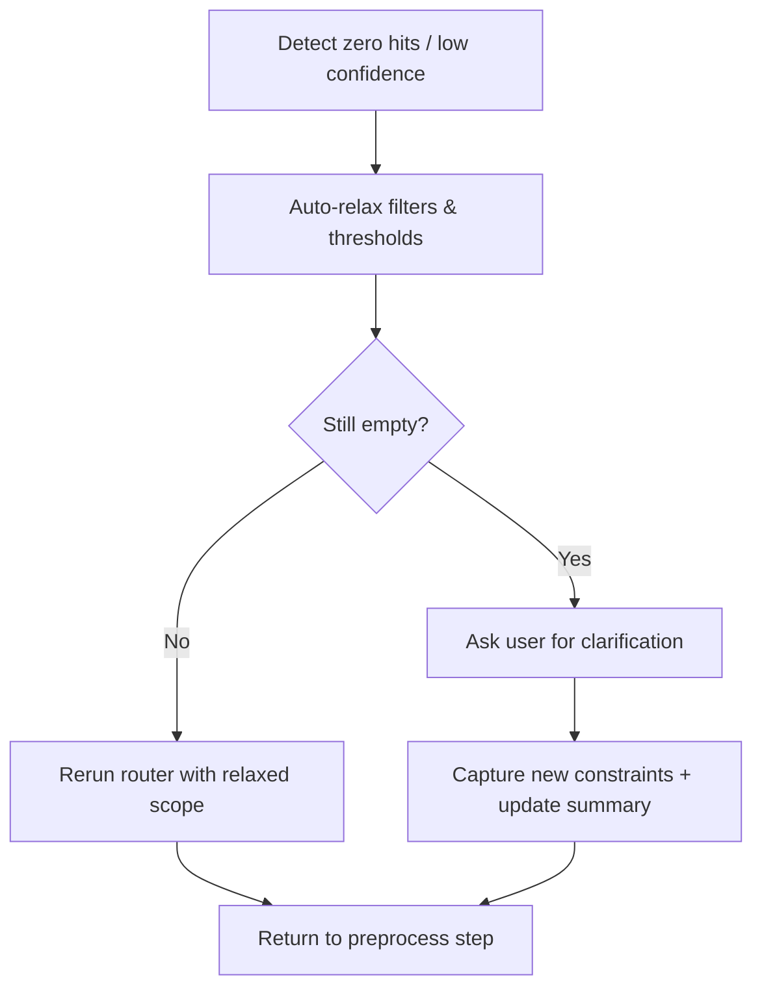

# Agentic Retrieval Workflow

This document outlines a generic agentic retrieval flow for a heterogeneous corpus (long/short documents, data-heavy forms, manuals, etc.). It supports queries such as “all receipts that contain tires” or “solar panels with certain dimensions”.

## 1. Data Primitives
- **Documents**: metadata includes category hints (long, short, data-heavy, text-heavy).
- **Segments**: tokenized snippets from each document; indexed via text search and embeddings.
- **Summaries**: macro-chunks (~10–20k tokens) with summary text and summary embeddings.
- **Annotations**: two shapes—single key-value facts and multi-column rows—each stored as properties JSON with provenance linking back to source segments/pages.
- **Embeddings**: stored for segments, summaries, and structured facts (kv or row); records track which target type they reference.
- **Tools**: `search_text`, `search_vector(scope=segment|summary)`, `annotations_search`, `annotations_aggregate`, `export_annotations_csv`.

## 2. Workflow Steps
1. **Preprocess Query**
   - Normalize string; detect keywords, operators, measurement units, and time ranges.
   - Classify intent: enumeration, numeric lookup, conceptual explanation.
   - Use a rolling conversation summary (≤300–400 tokens) to resolve pronouns (“those specs”) while honoring explicit “new topic” resets so the small model does not ingest stale context.

2. **Route Selection**
   - Combine intent, doc category hints, annotation coverage stats, and conversation summary signals to choose the retrieval plan.
   - Structured route (annotations) for enumerations/data-heavy docs; hybrid route (annotations + text) when coverage is uncertain; long-text route (summary + segment vectors) for conceptual/manual queries.

3. **Tool Planning**
   - Structured route → `annotations_search`, `annotations_aggregate` (filters via properties/typed props).
   - Text route → `search_text` constrained by doc categories.
   - Long-text route → `search_vector(scope=summary)` then `scope=segment` for drill-down.
   - Each planner instance pre-allocates fallback steps (e.g., widen filters, add vector search) that can be triggered when evidence is insufficient.

4. **Execute Structured Queries**
   - Example (“receipts containing tires”): search row annotations where `properties.item_desc~tires`, restricted to doc category “short/data-heavy” and the requested date range.
   - Example (“solar panels width <= 1.2m”): search key-value annotations whose field label contains “width” or “height” and apply numeric filters on `properties.value_num`; fall back to summary/vector search when no structured facts exist for a model.

5. **Long-text Retrieval**
   - Run summary-level embedding search; pick top summaries, fetch child segments; run a local vector search within each doc to refine snippets.

6. **Assemble Evidence**
   - Deduplicate by doc; keep multiple references when meaningful.
   - Build structured tables (rows with doc refs) and textual snippets; include source IDs, doc titles, page numbers.

7. **Prompt Construction**
   - Compress structured results into compact markdown/CSV-style blocks (limit rows, mention export option when large).
   - Combine textual snippets (top N) and summary context; enforce token budget.
   - Prompt template: system instructions + context bundle + user question.

8. **Answer Generation & Continuation**
   - Run local LLM; ensure citations `[source N]` per snippet/row.
   - Clip inputs to a small context window, keeping only the latest answer plus the rolling summary for continuity.
   - If `finish_reason != stop`, use continuation path (reuse last question, trimmed context).
   - Update the short conversation summary and store any structured result IDs for follow-up commands (“show the rest”, “export that table”).

9. **Post-processing**
   - Return answer, sources, structured payload (for UI/CSV), router decision metadata.
   - Persist router decisions, snippet IDs, and clarification prompts for debugging and analytics.

10. **Fallbacks, Clarifications & Logging**
    - Detect zero hits or low-confidence evidence after each retrieval batch; auto-relax filters (categories, score cutoffs, time windows) before bothering the user.
    - If results remain empty, ask the user for more details (synonyms, doc types, timeframes), then restart at preprocessing with the clarified input.
    - Log every fallback path, clarification, and rerun so troubleshooting can trace the conversation.

## 3. High-Level Workflow Diagram

## 4. Route Selection Detail

## 5. Clarification & Multi-turn Loop

## 6. Notes
- Structured responses expose CSV export endpoints when row count exceeds UI limits.
- Router configuration uses rule-based dispatch keyed by document categories and intent signals.
