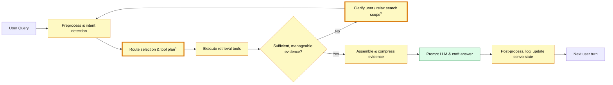
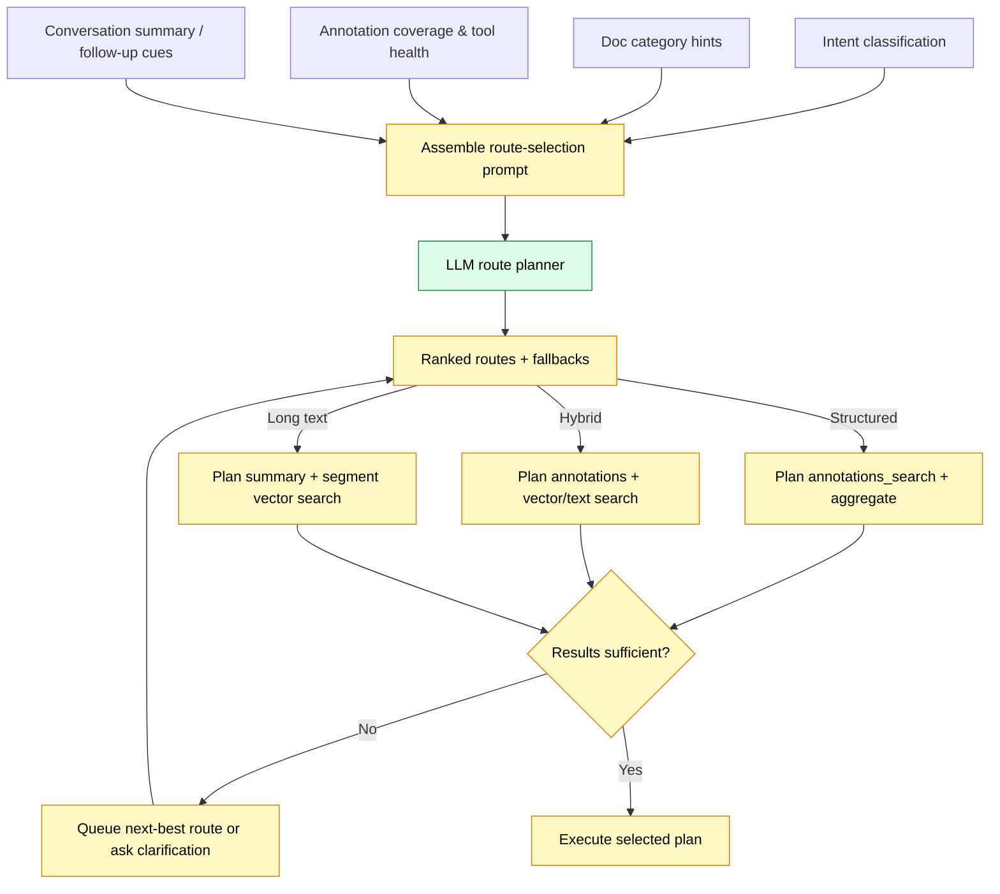
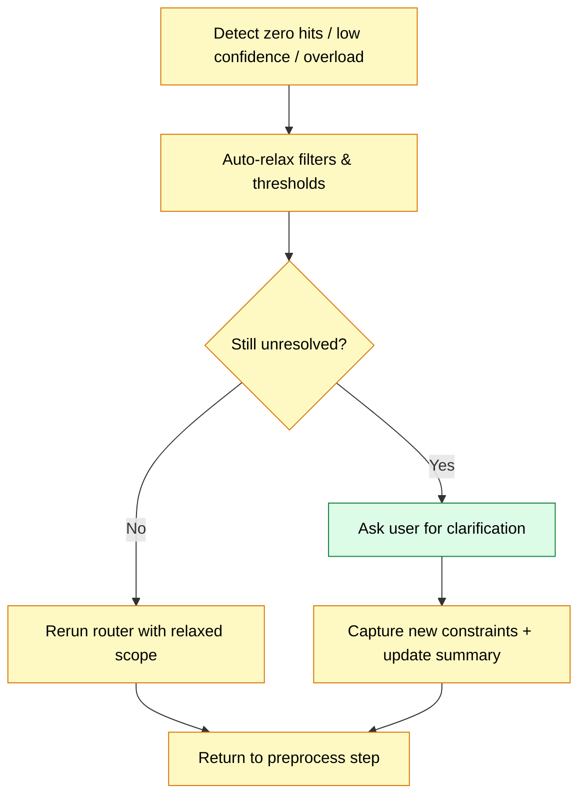

# Agentic Retrieval Workflow

This document outlines a generic agentic retrieval flow for a heterogeneous corpus (long/short documents, data-heavy forms, manuals, etc.). It supports queries such as “all receipts that contain tires” or “solar panels with certain dimensions”.

## 1. Data Primitives
- **Documents**: metadata includes category hints (long, short, data-heavy, text-heavy).
- **Segments**: tokenized snippets from each document; indexed via text search and embeddings.
- **Summaries**: macro-chunks (~10–20k tokens) with summary text and summary embeddings.
- **Annotations**: two shapes—single key-value facts and multi-column rows—each stored as properties JSON with provenance linking back to source segments/pages.
- **Embeddings**: stored for segments, summaries, and structured facts (kv or row); records track which target type they reference.
- **Tools**: `search_text`, `search_vector(scope=segment|summary)`, `annotations_search`, `annotations_aggregate`, `export_annotations_csv`.

## 2. Workflow Steps
1. **Preprocess Query**
   - Normalize string; detect keywords, operators, measurement units, and time ranges.
   - Classify intent: enumeration, numeric lookup, conceptual explanation.
   - Use a rolling conversation summary (≤300–400 tokens) to resolve pronouns (“those specs”) while honoring explicit “new topic” resets so the small model does not ingest stale context.

2. **Route Selection**
   - Package the normalized question, conversation summary, candidate intents, document-category stats, and tool-health metrics into a dedicated route-selection prompt.
   - A lightweight LLM call scores the available routes (structured / hybrid / long-text) and outputs the top choice plus an ordered fallback list that downstream planners can execute.
   - Structured route (annotations) for enumerations/data-heavy docs; hybrid route (annotations + text) when coverage is uncertain; long-text route (summary + segment vectors) for conceptual/manual queries.

3. **Tool Planning**
   - Structured route → `annotations_search`, `annotations_aggregate` (filters via properties/typed props).
   - Text route → `search_text` constrained by doc categories.
   - Long-text route → `search_vector(scope=summary)` then `scope=segment` for drill-down.
   - Each planner instance pre-allocates fallback steps (e.g., widen filters, add vector search) that can be triggered when evidence is insufficient.
   - Annotation search operates on both metadata filters and an embedding index over serialized key/value text so fuzzy label matches (“qty”, “quantity”, etc.) can be retrieved without exact keyword overlap.

4. **Execute Structured Queries**
   - Example (“receipts containing tires”): search row annotations where `properties.item_desc~tires`, restricted to doc category “short/data-heavy” and the requested date range.
   - Example (“solar panels width <= 1.2m”): search key-value annotations whose field label contains “width” or “height” (lexical OR embedding similarity) and apply numeric filters on `properties.value_num`; fall back to summary/vector search when no structured facts exist for a model.

5. **Long-text Retrieval**
   - Run summary-level embedding search; pick top summaries, fetch child segments; run a local vector search within each doc to refine snippets.

6. **Assemble Evidence**
   - Deduplicate by doc; keep multiple references when meaningful.
   - Build structured tables (rows with doc refs) and textual snippets; include source IDs, doc titles, page numbers.
   - When raw matches exceed `max_rows_per_answer` / `max_snippets_per_answer`, persist the full result set for pagination/export and keep only the highest-scoring slice for the current turn.

7. **Prompt Construction**
   - Compress structured results into compact markdown/CSV-style blocks (limit rows, mention export option when large).
   - Combine textual snippets (top N) and summary context; enforce token budget.
   - If truncation occurred, note the overflow count and prime the clarification stage so the user can narrow scope (“filter by vendor?”) before another full rerun.
   - Prompt template: system instructions + context bundle + user question.

8. **Answer Generation & Continuation**
   - Run local LLM; ensure citations `[source N]` per snippet/row.
   - Clip inputs to a small context window, keeping only the latest answer plus the rolling summary for continuity.
   - If `finish_reason != stop`, use continuation path (reuse last question, trimmed context).
   - Update the short conversation summary and store any structured result IDs for follow-up commands (“show the rest”, “export that table”).

9. **Post-processing**
   - Return answer, sources, structured payload (for UI/CSV), router decision metadata.
   - Persist router decisions, snippet IDs, and clarification prompts for debugging and analytics.

10. **Fallbacks, Clarifications & Logging**
    - Detect zero hits, low-confidence evidence, or overwhelming hit counts after each retrieval batch; auto-relax filters (categories, score cutoffs, time windows) before bothering the user.
    - If results remain empty, or if the hit count still exceeds the prompt budget, ask the user for more details (synonyms, doc types, timeframes, filters) and then restart at preprocessing with the clarified input.
    - Log every fallback path, clarification, overflow summary, and rerun so troubleshooting can trace the conversation.

## 3. High-Level Workflow Diagram


Nodes marked with <sup>1</sup> or <sup>2</sup> have dedicated detail diagrams in the sections below.

## 4. Route Selection Detail


## 5. Clarification & Multi-turn Loop


## 6. Prompt Templates
1. **Route Selection Prompt**
   - Purpose: let a lightweight LLM decide among structured / hybrid / long-text routes using the latest question, conversation summary, document inventory, and tool health.
   - Template:
```text
System: You are a retrieval router. Choose the best plan for the small RAG system. 
Conversation summary: {{summary<=350 tokens}}
User question: {{question}}
Detected intent: {{intent_label}}
Annotation coverage: {{coverage_pct}}
Tool health: {{status per tool}}
Respond with JSON: {"route": "...", "fallbacks": ["...","..."], "reason": "..."}
```

2. **Clarification Prompt**
   - Triggered when auto-relaxation still yields zero/low-confidence evidence or when the hit count exceeds the prompt budget. The prompt explains the situation so the user can refine scope (add terms, filters, priority ranges).
```text
System: Retrieval cannot proceed with the current scope (Reason: {{reason_summary}}). Summarize what was tried and ask for targeted clarification.
User question: {{question}}
Attempts tried:
- {{attempt_1}} (matches: {{match_count_1}}, threshold: {{threshold_1}})
- {{attempt_2}} ...
Result summary: {{result_summary}} (e.g., 0 matches, or 1,024 matches > 200 limit)
Please ask the user for: {{intent_specific_hints}} (e.g., alternate terms, product IDs, timeframe, acceptable ranges, filters).
Offer example follow-ups such as “search all documents”, “filter by vendor ACME”, or “switch to text search” when appropriate.
```
   - Example (numeric lookup intent, zero hits):
```text
System: Retrieval cannot proceed with the current scope (Reason: no width entries matched). Summarize what was tried and ask for targeted clarification.
User question: “What is the minimum panel width for AlphaSolar models?”
Attempts tried:
- annotations_search label~"width" doc_category=data-heavy (matches: 0, threshold: exact match)
- summary vectors query="AlphaSolar width" (matches: 0, threshold: cosine>=0.4)
Please ask the user for: alternate model names, acceptable width ranges in meters, or specific upload dates. Offer example follow-ups such as “search all documents” or “switch to text search” when appropriate.
```
   - Example (enumeration intent, overflow hits):
```text
System: Retrieval cannot proceed with the current scope (Reason: 1,042 matching receipts > 50 snippet limit). Summarize what was tried and ask for targeted clarification.
User question: “List every tire purchase receipt.”
Attempts tried:
- annotations_search properties.item_desc~"tire" date>=2023 (matches: 1,042, threshold: top 50)
- search_text query="tire receipt" categories=short (matches: 987, threshold: top 40)
Result summary: 1,042 candidate rows stored for export.
Please ask the user for: date ranges, vendor names, or quantity thresholds. Offer example follow-ups such as “filter to 2024 only” or “export the full CSV”.
```

3. **Answer Generation Prompt**
   - Consumes the compressed context bundle (structured rows + snippets) and enforces citations plus brevity for the small model.
```text
System: You must answer only with the evidence provided below. Cite every statement as [source N]. If the context is insufficient, say so and list what is missing.

Structured rows:
{{table_block}}  (include source IDs)

Snippets:
{{snippet_block}}

Question: {{question}}

Output: 2-4 concise sentences or a short bullet list + sources. Mention next actions only if data is missing.
```

## 7. Notes
- Structured responses expose CSV export endpoints when row count exceeds UI limits.
- Router configuration uses rule-based dispatch keyed by document categories and intent signals.
