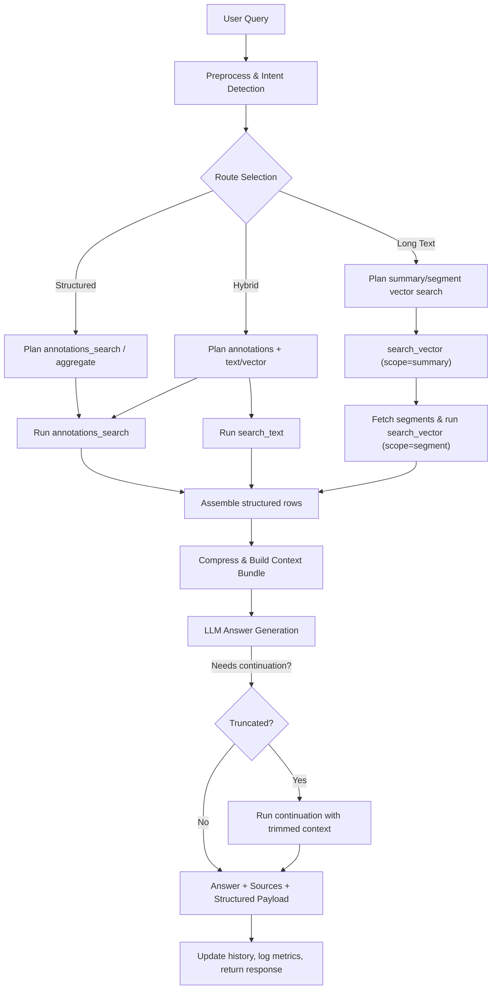

# Agentic Retrieval Workflow

This document outlines a generic agentic retrieval flow for a heterogeneous corpus (long/short documents, data-heavy forms, manuals, etc.). It supports queries such as “all receipts that contain tires” or “solar panels with certain dimensions”.

## 1. Data Primitives
- **Documents**: metadata includes category hints (long, short, data-heavy, text-heavy).
- **Segments**: tokenized snippets from each document; indexed via text search and embeddings.
- **Summaries**: macro-chunks (~10–20k tokens) with summary text and summary embeddings.
- **Annotations**: two shapes—single key-value facts and multi-column rows—each stored as properties JSON with provenance linking back to source segments/pages.
- **Embeddings**: stored for segments, summaries, and structured facts (kv or row); records track which target type they reference.
- **Tools**: `search_text`, `search_vector(scope=segment|summary)`, `annotations_search`, `annotations_aggregate`, `export_annotations_csv`.

## 2. Workflow Steps
1. **Preprocess Query**
   - Normalize string; detect keywords, operators, measurement units, time ranges.
   - Classify intent: enumeration, numeric lookup, conceptual explanation.

2. **Route Selection**
   - Use intent + doc category hints to choose retrieval plan:
     - Structured route (annotations) for enumerations/data-heavy docs.
     - Hybrid (annotations + text) when coverage uncertain.
     - Long-text route (summary + segment vectors) for conceptual/manual queries.

3. **Tool Planning**
   - Structured route → `annotations_search`, `annotations_aggregate` (filters via properties/typed props).
   - Text route → `search_text` constrained by doc categories.
   - Long-text route → `search_vector(scope=summary)` then `scope=segment` for drill-down.
   - Always keep fallbacks queued (e.g., run vector search if annotations yield sparse results).

4. **Execute Structured Queries**
   - Example (“receipts containing tires”): search row annotations where `properties.item_desc~tires`, restricted to doc category “short/data-heavy” and the requested date range.
   - Example (“solar panels width <= 1.2m”): search key-value annotations whose field label contains “width” or “height” and apply numeric filters on `properties.value_num`; fall back to summary/vector search when no structured facts exist for a model.

5. **Long-text Retrieval**
   - Run summary-level embedding search; pick top summaries, fetch child segments; run a local vector search within each doc to refine snippets.

6. **Assemble Evidence**
   - Deduplicate by doc; keep multiple references when meaningful.
   - Build structured tables (rows with doc refs) and textual snippets; include source IDs, doc titles, page numbers.

7. **Prompt Construction**
   - Compress structured results into compact markdown/CSV-style blocks (limit rows, mention export option when large).
   - Combine textual snippets (top N) and summary context; enforce token budget.
   - Prompt template: system instructions + context bundle + user question.

8. **Answer Generation & Continuation**
   - Run local LLM; ensure citations `[source N]` per snippet/row.
   - If finish_reason != stop, use continuation path (reuse last question, trimmed context).

9. **Post-processing**
   - Return answer, sources, structured payload (for UI/CSV), router decision metadata.
   - Update conversation history, summary.

10. **Fallbacks & Logging**
    - If no results, relax filters or ask user for clarification.
    - Log router decisions, tool latencies, snippet IDs for debugging.

## 3. Mermaid Diagram

## 4. Notes
- Structured responses expose CSV export endpoints when row count exceeds UI limits.
- Router configuration uses rule-based dispatch keyed by document categories and intent signals.
