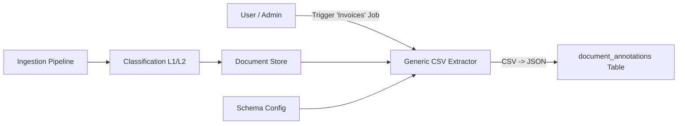

# Document Extraction & Annotation Plan (Revised)

This document outlines the design for adding an **Extraction Phase** to the ingestion pipeline. This phase enriches documents with structured metadata (e.g., Dates, Parties, Amounts) to enable precise filtering in the Agentic RAG workflow.

**Strategy Update:** We are adopting an **On-Demand, Schema-Driven, CSV-based** extraction strategy with **Dedicated SQL Tables**. This ensures cost-efficiency (only extracting what's needed), token-efficiency (CSV output), and high-performance querying (native SQL tables).

---

## 1. Objective

Enable the RAG Agent to execute structured queries like *"Find contracts from 2023 with value > $10k"* by pre-extracting these fields into a SQL-queriable format.

---

## 2. Architecture: "Ingest First, Extract Later"

Unlike the initial plan to run extraction automatically on every document, we will support an **On-Demand Batch Workflow**.

1.  **Ingestion:** Documents are OCR'd, Chunked, and Classified (L1/L2). No deep extraction happens here to save costs.
2.  **Trigger:** A user (or automated rule) triggers an extraction job for a specific **Category** (e.g., "Invoices") using a defined **Schema**.
3.  **Execution:** The Generic Extraction Engine iterates over the target documents, uses an LLM to extract data in **CSV format**, and persists the results.



---

## 3. Generic Extraction Strategy (The "Engine")

We will implement a single, generic function `extract_batch(docs, schema)` that does not contain hardcoded logic for specific document types.

### 3.1. Schema Configuration
We define "Shapes" of data in a configuration registry. This schema serves two purposes:
1.  **Prompt Generation:** Telling the LLM what to extract.
2.  **Table Definition:** Defining the columns for the dedicated SQL table.

**Example Schema (Invoices):**
```json
{
  "target_category": "invoices",
  "table_name": "meta_invoices",
  "fields": [
    {"name": "invoice_number", "type": "TEXT", "desc": "Unique identifier"},
    {"name": "invoice_date", "type": "DATE", "desc": "Date of issue (ISO)"},
    {"name": "total_amount", "type": "REAL", "desc": "Total value numeric"},
    {"name": "currency", "type": "TEXT", "desc": "Currency code (USD, EUR)"},
    {"name": "vendor_name", "type": "TEXT", "desc": "Issuer organization"}
  ]
}
```

### 3.2. CSV-Based LLM Prompting
To reduce token usage by ~30-40% compared to JSON, we instruct the LLM to output a CSV block.

> "You are a data extractor. For the following documents, extract these columns: [invoice_date, total_amount...]. Output ONLY a CSV block with headers."

### 3.3. Persistence: Dedicated Tables
Instead of a generic JSON blob, we map each Category to a **Dedicated Table**.
*   **Performance:** Native SQL types (REAL, DATE) allow for fast range queries (`amount > 1000`) without JSON parsing overhead.
*   **Integrity:** We can enforce types and constraints.
*   **Simplicity:** The CSV output from the LLM maps 1:1 to the table columns.

---

## 4. Database Schema

We will dynamically create tables based on the Schema Registry.

**Core Linking:**
All metadata tables link back to the main `documents` table via `doc_hash`.

**Example DDL (Auto-Generated):**
```sql
CREATE TABLE IF NOT EXISTS meta_invoices (
    doc_hash TEXT PRIMARY KEY,
    invoice_number TEXT,
    invoice_date TEXT, -- SQLite uses TEXT for dates
    total_amount REAL,
    currency TEXT,
    vendor_name TEXT,
    created_at TEXT DEFAULT CURRENT_TIMESTAMP,
    FOREIGN KEY(doc_hash) REFERENCES documents(doc_hash) ON DELETE CASCADE
);
```

---

## 5. Integration with Agentic RAG

This extraction phase is the **Enabler** for the Agentic RAG plan.

1.  **Shared Truth:** The **Schema Config** serves as the source of truth for the Agent's **Query Decomposer**.
2.  **Filtering:** The RAG tools (`search_text`, `search_semantic`) will accept a `filters` argument that maps directly to SQL `WHERE` clauses on the metadata table.
    *   *Agent Query:* `amount > 1000`
    *   *SQL Translation:* `SELECT d.content FROM documents d JOIN meta_invoices m ON d.doc_hash = m.doc_hash WHERE m.total_amount > 1000`

---

## 6. Implementation Steps (Pilot: Invoices)

### Step 1: Define Schema (`backend/services/ingestion/extraction_schemas.py`)
- Create the generic Schema registry.
- Add the `invoices` schema definition with SQL types.

### Step 2: Implement Engine (`backend/services/ingestion/extraction.py`)
- Implement `extract_metadata_csv(doc_hashes, schema)`.
- Implement `ensure_table_exists(schema)` to dynamically create tables.
- Implement CSV-to-SQL-Insert logic.

### Step 3: Update Persistence (`backend/persistence.py`)
- Remove legacy annotation logic.
- Add helpers for dynamic table querying.

### Step 4: Add Trigger (`backend/services/ingestion/worker.py`)
- Add a task/function to trigger extraction for a given L1/L2 category.
