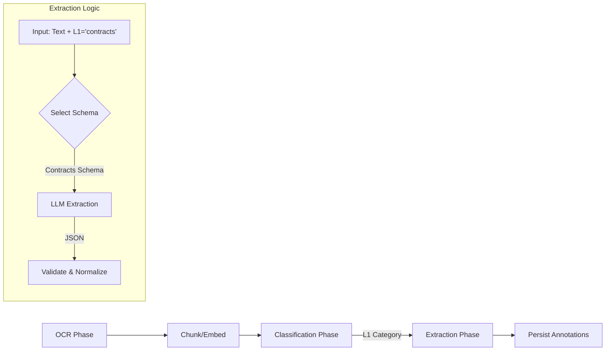

# Document Extraction & Annotation Plan

This document outlines the design for adding an **Extraction Phase** to the ingestion pipeline. This phase enriches documents with structured metadata (e.g., Dates, Parties, Amounts) to enable precise filtering in the Agentic RAG workflow.

---

## 1. Objective

Enable the RAG Agent to execute structured queries like *"Find contracts from 2023 with value > $10k"* by pre-extracting these fields into a SQL-queriable format during ingestion.

---

## 2. Architecture & Workflow

The Extraction Phase runs **after** the Classification Phase because the schema depends on the document type (L1 Category).



### 2.1. Trigger Condition
- The Extraction Phase runs for all documents where `classification_status = 'classified'`.
- It uses the `l1_id` (e.g., `contracts`, `invoices`, `datasheets`) to determine *what* to extract.

---

## 3. Schemas & Taxonomy

We will define schemas for each top-level category.

### 3.1. Contracts
- **Fields:**
  - `effective_date` (ISO Date)
  - `expiration_date` (ISO Date)
  - `parties` (List[String])
  - `contract_type` (String - e.g. "NDA", "MSA")
  - `value_amount` (Number)
  - `value_currency` (String)

### 3.2. Invoices / Receipts
- **Fields:**
  - `invoice_date` (ISO Date)
  - `vendor_name` (String)
  - `invoice_number` (String)
  - `total_amount` (Number)
  - `currency` (String)
  - `line_items_summary` (String)

### 3.3. Datasheets / Technical
- **Fields:**
  - `product_name` (String)
  - `manufacturer` (String)
  - `revision_date` (ISO Date)
  - `key_specs` (JSON/Dict - e.g. `{"voltage": "5V", "package": "TO-220"}`)

### 3.4. Generic / Miscellaneous
- **Fields:**
  - `summary` (String)
  - `keywords` (List[String])
  - `document_date` (ISO Date)

---

## 4. Database Schema

We will introduce a new table `document_annotations` (or `doc_metadata`) to store these fields. To keep it flexible but queriable, we can use a **Hybrid Approach**:
1.  **Core Columns:** Common fields like `doc_date`, `doc_type` stored as columns for fast indexing.
2.  **JSON Column:** Domain-specific fields stored as JSONB (or Text in SQLite) for flexibility.

**Proposed Table:** `document_annotations`

```sql
CREATE TABLE document_annotations (
    doc_hash TEXT PRIMARY KEY,
    -- Core Indexable Fields
    category_l1 TEXT NOT NULL,
    primary_date TEXT,       -- effective_date, invoice_date, etc.
    primary_entity TEXT,     -- party_name, vendor, manufacturer
    primary_amount REAL,     -- contract value, invoice total
    currency TEXT,
    
    -- Full Structured Data
    data_json TEXT NOT NULL, -- The full extracted JSON object
    
    created_at TEXT NOT NULL,
    updated_at TEXT NOT NULL,
    FOREIGN KEY(doc_hash) REFERENCES documents(doc_hash) ON DELETE CASCADE
);
```

---

## 5. Implementation Plan

### Step 1: Define Schemas (`backend/services/ingestion/extraction_schemas.py`)
- Create Pydantic models or JSON schemas for each L1 category.
- Define the prompts for the LLM.

### Step 2: Implement Logic (`backend/services/ingestion/extraction.py`)
- Function `extract_metadata(doc_hash, text, l1_id)`:
  - Selects prompt based on L1.
  - Calls LLM (Qwen) with `response_format={"type": "json_object"}` (if supported) or prompts for JSON.
  - Parses and Validates JSON.
  - Returns structured data.

### Step 3: Update Worker (`backend/services/ingestion/worker.py`)
- Add `extraction` to the `DEFAULT_PHASES`.
- Implement `_run_extraction_phase` similar to `_run_classification_phase`.

### Step 4: Update Persistence (`backend/persistence.py`)
- Add `document_annotations` table creation.
- Add `save_document_annotations` method.
- Add `get_document_annotations` method.

### Step 5: Integration with RAG
- Update `rag.py` (or the new Agentic Orchestrator) to query `document_annotations` when the Planner requests filters.

---

## 6. Iteration Strategy

1.  **Start Small:** Implement schema for **Invoices** or **Contracts** only first.
2.  **Test:** Run ingestion on a sample set. Verify SQLite data.
3.  **Expand:** Add more schemas.
4.  **Refine:** Tune prompts if extraction is poor.
