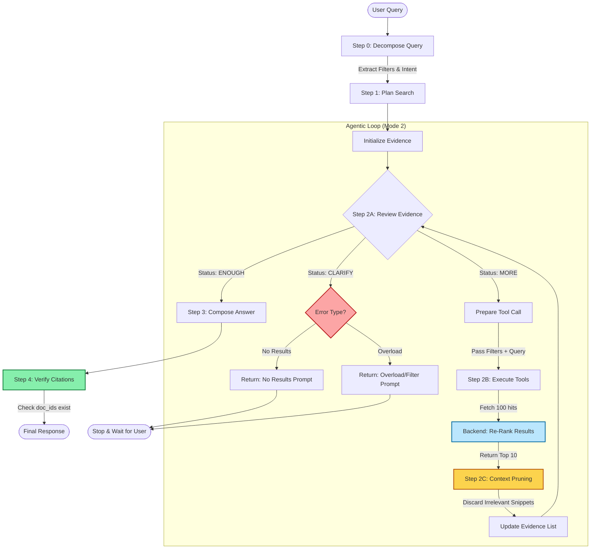
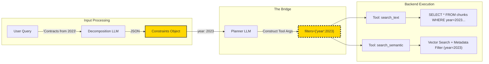
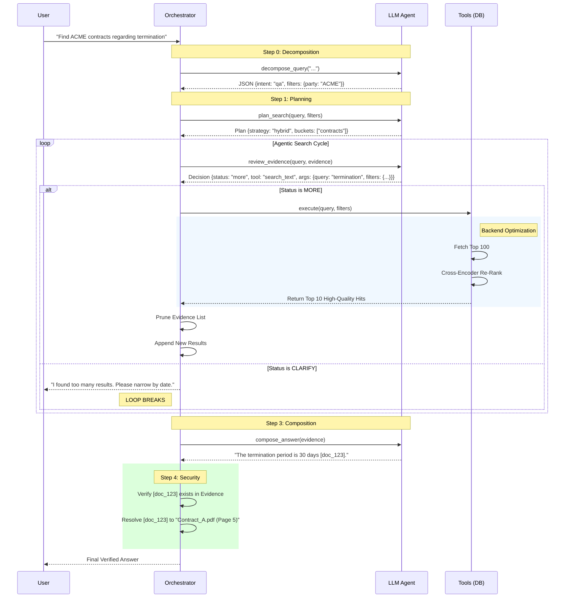

Here is the **patched and upgraded Agentic RAG Plan**.

I have integrated the fixes for the "Broken Bridge" (connecting decomposition constraints to search tools), added the missing "Clarification" logic to the reviewer loop, tightened the context window management, and clarified the hybrid search strategy.

-----

# Agentic RAG Plan for Large Document Corpora (Patched Version)

This document describes an **agentic Retrieval-Augmented Generation (RAG)** pattern for searching across large, bucketed document collections (e.g., invoices, datasheets, contracts, certificates).

It is designed for corpora with **100k–1M+ pages**, where:

  - Documents are grouped into *buckets*.
  - The LLM acts as an agent that plans searches, refines queries, and composes answers.
  - **Key Upgrade:** The system supports structured metadata filtering and explicit clarification loops to handle complex constraints and ambiguity.

-----

## 1\. High-Level Overview

### Goals

  - **Agentic Workflow:** The LLM plans, searches, reviews, and answers.
  - **Hybrid Capability:** Combines structured filtering (dates, types) with unstructured text/semantic search.
  - **Guardrails:** Explicitly manages context window usage and "clarification" states when results are poor or overwhelming.

### Core Components

1.  **Indexes / Storage:**
      * Pre-chunked text indexed by `bucket`, `doc_id`, etc.
      * **Metadata Stores:** To support strict filtering (e.g., `year=2023`).
      * **Re-Ranking (Backend):** Tools internally fetch high-recall sets (e.g., 100 hits) and re-rank them to a low `top_k` (e.g., 5–10) before returning to the LLM.
2.  **Search Tools:** `search_text`, `search_semantic`, `get_document_metadata`.
3.  **LLM Agent:** Operates in Plan $\to$ Review $\to$ Answer cycles.
4.  **Orchestrator:** Manages the loop, context pruning, and tool execution.

-----

## 2\. Tools Exposed to the LLM

**Update:** Tools now accept a `filters` argument to close the gap between query decomposition and retrieval. Defaults for `top_k` are lowered to prevent context explosion.

### 2.1. `search_text`

  - **Purpose**: Keyword/phrase search with optional metadata filtering.
  - **Backend Note**: Should use a BM25 or similar keyword index.

<!-- end list -->

```jsonc
{
  "name": "search_text",
  "description": "Keyword search within a specific bucket. Supports metadata filtering.",
  "parameters": {
    "type": "object",
    "properties": {
      "bucket": { "type": "string", "description": "Target bucket (e.g., invoices, contracts)." },
      "query": { "type": "string", "description": "Keyword string." },
      "filters": {
        "type": "object",
        "description": "Key-value pairs for metadata filtering (e.g., {'year': 2023, 'party': 'ACME'}).",
        "additionalProperties": true,
        "nullable": true
      },
      "top_k": { "type": "integer", "default": 10, "description": "Number of snippets to return." },
      "context_chars": { "type": "integer", "default": 400 },
      "doc_id": { "type": "string", "description": "Scope search to a specific document.", "nullable": true }
    },
    "required": ["bucket", "query"]
  }
}
```

### 2.2. `search_semantic`

  - **Purpose**: Dense vector retrieval.
  - **Backend Note**: Ideally implements a Re-Ranking step (Cross-Encoder) internally to ensure the top 10 results are high quality.

<!-- end list -->

```jsonc
{
  "name": "search_semantic",
  "description": "Semantic/Vector search within a specific bucket. Supports metadata filtering.",
  "parameters": {
    "type": "object",
    "properties": {
      "bucket": { "type": "string" },
      "query": { "type": "string", "description": "Natural language query for embedding." },
      "filters": {
        "type": "object",
        "description": "Metadata filters (e.g., {'device_type': 'NPN'}).",
        "nullable": true
      },
      "top_k": { "type": "integer", "default": 10 },
      "context_chars": { "type": "integer", "default": 500 },
      "doc_id": { "type": "string", "nullable": true }
    },
    "required": ["bucket", "query"]
  }
}
```

### 2.3. `get_document_metadata`

  - **Purpose**: Retrieve full metadata for a document (useful when checking if a document meets complex criteria not indexable).

<!-- end list -->

```jsonc
{
  "name": "get_document_metadata",
  "parameters": {
    "type": "object",
    "properties": { "doc_id": { "type": "string" } },
    "required": ["doc_id"]
  }
}
```

-----

## 3\. Agentic RAG: Three Conceptual Modes

### 3.1. Mode 1 – `plan_search(query)`

**Update:** Explicit instructions to use the `filters` argument based on decomposition data.

**System Prompt:**

> You are a search planner.
> Based on the user query, generate a search plan.
>
> 1.  Identify the most relevant `target_buckets`.
> 2.  Determine `strategy`:
>       - "keyword": Specific terms/IDs.
>       - "semantic": Conceptual questions.
>       - "hybrid": You intend to run **both** keyword and semantic searches.
> 3.  Construct `initial_queries`. If the user specifies metadata (dates, companies, types), you MUST plan to pass these as `filters` in your tool calls later.
>
> Output JSON only.

**Example Output:**

```json
{
  "target_buckets": ["contracts"],
  "strategy": "hybrid",
  "initial_queries": ["termination notice"],
  "filters_hint": {"party": "ACME", "year": 2023},
  "max_tool_calls": 4
}
```

### 3.2. Mode 2 – `review_evidence(query, plan, evidence)`

**Update:** Added the `"clarify"` status so the agent isn't forced to hallucinate when results are missing.

**System Prompt:**

> You are the search controller. Review the user query and collected evidence.
> Decide on the next step.
> Output JSON with:
>
>   - `status`: "enough" (ready to answer), "more" (keep searching), or "clarify" (cannot proceed/too many results).
>   - `reason`: Explanation.
>   - `next_tool_call`: Tool definition (if status is "more"). Use `filters` if constraints exist.
>   - `clarification_details`: (if status is "clarify") Object with `type` ("no\_results" or "overload") and `missing_info`.

**Example ("More" - Drilling down):**

```json
{
  "status": "more",
  "reason": "Found the contract list, now need the specific PDF content.",
  "next_tool_call": {
    "tool": "search_text",
    "args": {
      "bucket": "contracts",
      "query": "termination clause",
      "filters": {"doc_id": "contract_123"}
    }
  }
}
```

**Example ("Clarify" - No results):**

```json
{
  "status": "clarify",
  "reason": "No datasheets found for 'FluxCapacitor 2000' with the given filters.",
  "clarification_details": {
    "type": "no_results",
    "missing_info": "Check model name or relax year constraint."
  }
}
```

### 3.3. Mode 3 – `compose_answer(query, evidence)`

**Update:** Strict citation formatting to prevent ID hallucination.

**System Prompt:**

> Answer the user query using ONLY the provided evidence.
>
>   - **Citations:** You must cite your sources using the format `[doc_id]`. Do NOT make up doc\_ids. Copy them exactly from the evidence snippets.
>   - If the evidence is contradictory or incomplete, state that clearly.

-----

## 4\. Orchestrator Loop (Patched)

This loop now handles the `clarify` status and includes a **Context Pruning** step (Logic 2b) to prevent the context window from filling up with irrelevant snippets from early search steps.

```python
def agentic_answer(user_query):
    # 0) Pre-computation
    decomposition = llm_decompose_query(user_query) # See Section 8
    
    # 1) Plan
    plan = llm_plan_search(user_query, decomposition)
    evidence = []

    # 2) Iterative search
    for step in range(plan["max_tool_calls"]):
        # A. Review current state
        decision = llm_review_evidence(user_query, plan, evidence)

        # B. Handle Completion
        if decision["status"] == "enough":
            break

        # C. Handle Clarification (Break loop, ask user)
        if decision["status"] == "clarify":
            details = decision["clarification_details"]
            return format_clarification_request(details["type"], details["missing_info"])

        # D. Execute Next Tool
        next_call = decision["next_tool_call"]
        if not next_call: break
        
        raw_results = execute_tool(next_call["tool"], **next_call["args"])

        # E. Context Pruning (Crucial for large searches)
        # Optional: Ask LLM which previous evidence items are irrelevant and remove them
        # or simply append new results and rely on a sliding window if 'raw_results' is small.
        evidence.append({
            "step": step,
            "tool": next_call["tool"],
            "results": raw_results
        })

    # 3) Compose final answer
    final_answer = llm_compose_answer(user_query, evidence)
    
    # 4) Post-process citations (Security)
    # Verify that every [doc_id] in final_answer actually exists in evidence.
    final_answer = verify_citations(final_answer, evidence)
    
    return final_answer
```

-----

## 8\. Query Decomposition (The Input to the Plan)

**Update:** This section remains structurally similar, but it is now the **authoritative source** for the `filters` argument used in Sections 2 and 3.

**Schema:**

```jsonc
{
  "intent": "qa | list | summarize | compare",
  "primary_buckets": ["contracts", "invoices"],
  "constraints": [
    {
      "field": "year",
      "operator": "=",
      "value": 2023
    },
    {
      "field": "party",
      "operator": "=",
      "value": "ACME Corp"
    }
  ],
  "subqueries": ["termination notice"]
}
```

**Workflow Connection:**

1.  **Decomposition** finds `year=2023`.
2.  **Planner** sees this constraint.
3.  **Reviewer** generates `search_text(..., filters={'year': 2023})`.
4.  **Tool** executes DB query: `SELECT * FROM chunks WHERE content match '...' AND year = 2023`.

-----

## 10\. Clarification Scenarios

These map directly to the `status: "clarify"` output in Mode 2.

### 10.1 No/Low Results

  - **Trigger:** Tool returns 0 results after relaxation attempts.
  - **Agent Output:**
    ```json
    {"status": "clarify", "clarification_details": {"type": "no_results"}}
    ```
  - **UI Response:** "I looked for contracts with 'ACME' in 2023 but found none. Would you like to search all years?"

### 10.2 Result Overload

  - **Trigger:** Tool returns 100+ hits, or `annotations_search` returns too many rows to summarize.
  - **Agent Output:**
    ```json
    {"status": "clarify", "clarification_details": {"type": "overload"}}
    ```
  - **UI Response:** "I found 1,200 invoices. Please narrow your search by date or amount, or ask for a CSV export."

-----

## Summary of Fixes in This Version

1.  **Closed the Filter Gap:** Tools now accept `filters`, allowing the rich data from Query Decomposition to actually be used by the backend.
2.  **Explicit Clarification:** The agent can now stop and ask for help (`status: "clarify"`) instead of hallucinating when it gets stuck.
3.  **Context Hygiene:** Lowered default `top_k` and introduced the concept of Pruning to prevent context overflow.
4.  **Citation Safety:** Added verification steps to ensure `doc_id`s in the final answer are real.


Here are the detailed Mermaid diagrams updated to reflect the **Patched Agentic RAG Plan**.

I have created three diagrams to visualize the specific improvements:

1.  **The Comprehensive Logic Flow** (Focuses on decisions, clarification, and pruning).
2.  **The Data Flow & Filter Bridge** (Focuses on how constraints travel from decomposition to tools).
3.  **The Sequence of Operations** (Focuses on timing, re-ranking, and citation verification).

### 1\. The Orchestrator Logic Flow

This diagram replaces the previous simple loop. It explicitly visualizes the **Clarification** exit routes, the **Pruning** step to save context, and the **Citation Verification** guardrail.



-----

### 2\. The "Broken Bridge" Fix (Data Flow)

This diagram highlights exactly how the **metadata gap** was closed. It shows how specific JSON constraints extracted in the beginning are physically passed into the tool arguments.



-----

### 3\. Sequence Diagram (Timing & Verification)

This detailed sequence shows the life-cycle of a request, including the **Re-ranking** (latency optimization) and **Citation Verification** (hallucination prevention).

