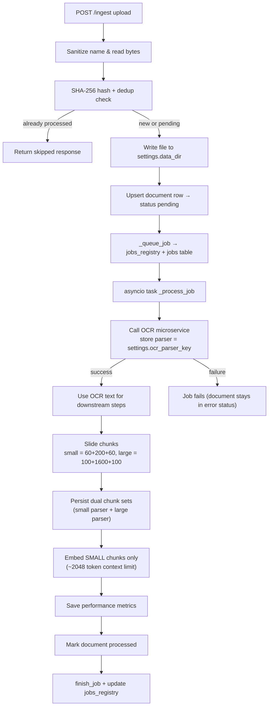

# Backend Ingestion Flow

_This note is based strictly on the current backend code (mainly `backend/services/ingestion.py`, `backend/routes`, `backend/persistence.py`, and `backend/config.py`)._

## Entry Points and Control Surfaces
- `POST /ingest` (`backend/routes/ingest.py`): accepts a `UploadFile`, hands it to `services.ingestion.ingest_file`, and returns the queued job id plus the file hash.
- `GET /status/{job_id}`: reads the in-memory `jobs_registry` entry that tracks runtime status (`queued`, `running`, `done`, or `error:…`).
- `POST /ingest/{doc_hash}/retry`: reloads the already stored binary from `settings.data_dir` and re-queues it via the same worker pipeline.
- `DELETE /documents/{doc_hash}` (`backend/routes/documents.py`): refuses to delete while jobs are `queued`/`running`, otherwise drops disk artifacts, deletes DB rows, and prunes lingering job history.
- `/system/status`, `/ready`, `/warmup`, `/warmup/mineru` (`backend/routes/system.py`): expose fleet status, show every tracked job, and send a warmup POST to the OCR microservice.

## Step-by-Step Pipeline

### 1. Upload intake, sanitizing, and deduplication
1. `ingest_file` ensures a file was provided and has non-empty bytes.
2. The original name is sanitized with `safe_filename`, then bytes are read, closed, and hashed with SHA-256.
3. `document_store.get_document(hash)` is used for dedup: if an entry exists with status `processed`, ingestion is skipped and the API returns `{status: "skipped"}` along with the stored metadata.
4. Otherwise, the file is persisted to `<settings.data_dir>/<sha>.ext` (preserving lower-cased extension when present).
5. `document_store.upsert_document` either creates or updates the row with status `pending`. Already-processed docs keep their `processed` flag until a new run completes successfully.

### 2. Persisted job bookkeeping and queueing
1. `_queue_job` allocates a UUID, writes a `jobs_registry` entry (`{"status": "queued", "file": name, "hash": doc_hash}`), and creates a DB job row via `document_store.create_job`.
2. An `asyncio.create_task` immediately launches `_process_job(job_id, path, hash, display_name)`. Because this queue is purely in-memory, restarts lose the outstanding job list and active tasks.

### 3. Background job `_process_job`
1. Runtime bookkeeping: it records per-stage durations (`mineru_time`, `chunking_time`, `embedding_time`, plus `total_time`). A local `update` helper keeps `jobs_registry` and the document status in sync.
2. State transition: `document_store.mark_job_started` flips the DB job to `running`, and the document status is set to `processing`.
3. **Mandatory OCR**:
   - `_call_ocr_module` runs first, streaming the stored file to `POST {settings.ocr_module_url}/parse` with `doc_hash` in `form_data`. The response must contain `text`; otherwise an error is raised and the ingestion job fails.
   - Successful OCR output is merged into the `extractions` table using `settings.ocr_parser_key` (defaults to `"mineru"`). Metadata is augmented with the source (`ocr`).
   - The text that feeds chunking/embeddings is always the OCR text. If the OCR service errors or returns empty text, `_process_job` raises so the document stays in `error` status instead of continuing.
4. **Chunking**:
   - The ingestion worker tokenizes once and now generates two synchronized views using `chunk_text_multi` (`backend/chunking.py`):
     - **Small chunks** → core window of 200 tokens with 60-token guard bands on both sides (defaults driven by `CHUNK_SIZE`/`CHUNK_OVERLAP`). These are stepped every 200 tokens so each core is disjoint; they remain the primary retrieval surface.
     - **Large chunks** → core window of 1600 tokens (exactly eight small cores) padded by 100 tokens on each side, stepped every 1600 tokens to stay aligned. They’re stored under `settings.large_chunk_parser_key` for future use.
   - Each chunk receives a deterministic id namespaced by its scale (e.g., `chunk-small-…`), and `document_store.replace_chunks` is invoked twice so both granularities live side-by-side in SQLite.
6. **Embeddings**:
   - A fresh `EmbeddingClient` is instantiated per job. It requires `EMBEDDING_BASE_URL`, `EMBEDDING_API_KEY`, and `EMBEDDING_MODEL` to be present; the client wraps `openai.AsyncOpenAI` against the configured base URL.
   - `_compute_embeddings_for_chunks` currently processes **only** the small-chunk rows to keep retrieval fast and inexpensive while the large view remains text-only support data.
   - Each embedding is wrapped in an `EmbeddingRow` (chunk id, doc hash, dim, model, `np.float32` vector) and persisted via `document_store.replace_embeddings`, which deletes previous embeddings for the document before bulk inserting serialized vectors.
   - The dockerized embedding runtime (`docker-compose.yml` → `llama-cpp-embed`) uses `EMBED_CONTEXT_SIZE` with a default of 2048 tokens, so the 200-token core + 60/60 guards easily fit; the large chunks (~1800 tokens) are stored for downstream composition but are not embedded yet.
7. **Metrics and completion**:
   - `document_store.save_performance_metrics` records the collected durations; failures are logged but do not block completion.
   - `document_store.mark_document_processed` flips the document to `processed`, clears errors, and sets `last_ingested_at`.
   - `document_store.finish_job(job_id, "done")` plus `jobs_registry[job_id]["status"] = "done"` finalize the run.
8. **Error paths**:
   - Any exception triggers `document_store.finish_job(job_id, "error", error=str(exc))`, `document_store.update_document_status(doc_hash, "error", error=…)`, and the job status becomes `error:<message>`.
   - Cancellation is handled separately to mark the job as `cancelled`.

### 4. Retry and deletion mechanics
- `retry_ingest` looks up the stored document record, verifies the binary still exists under `settings.data_dir`, and calls `_queue_job` again with the original `display_name`. The API response includes `{"retry": true}`.
- `delete_document` checks `jobs_registry` for any active job referencing the hash. When safe, it deletes the on-disk file (best effort), calls `document_store.delete_document` which cascades into `performance_metrics`, `embeddings`, `chunks`, `extractions`, and `jobs`, and removes every `jobs_registry` entry for the hash.

### 5. Operational notes
- Persistence is handled by `DocumentStore`, an async SQLite layer stored at `settings.doc_store_path` (defaults to `<DATA_DIR>/rag_meta.db`). The schema includes tables for documents, jobs, extractions, chunks, embeddings, and performance metrics. Foreign keys enforce cascade deletes.
- `jobs_registry` is purely in-memory; after a backend restart there is no knowledge of queued/running jobs even though the SQLite `jobs` table retains history.
- Uploaded binaries live under `settings.data_dir` (default `/app_data/docs`). The directory is created on startup by `load_settings()`.
- OCR warmup hits `{settings.ocr_module_url}/warmup` via `warmup_mineru()` to pre-pay cold-start costs.

## Mermaid Diagram

## Status Checklist
- Happy-path ingestion covers: upload validation, deduping, disk persistence, DB tracking, mandatory OCR, chunking, embedding, metrics, completion, and status reporting.
- Recovery flows implemented: retrying from stored binaries, deletion with safety checks, job status inspection, OCR warmup.
- Remaining caveats observed in code:
  - Job tracking is memory-only, so restarts orphan active work.
  - Each ingestion instantiates a new `EmbeddingClient`; there is no connection pooling or batching across documents.
- OCR text is mandatory for chunking and embeddings; ingestion fails fast if the OCR step cannot produce text.
