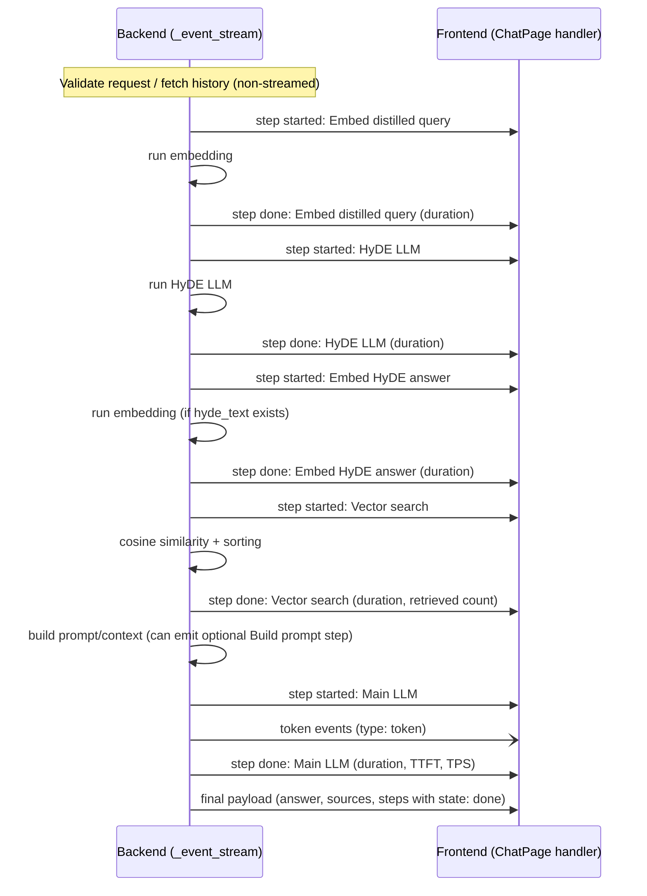

# Streaming Pipeline Step Signals – Plan & Diagram

This document sketches how to stream pipeline steps so each box appears as the work starts/finishes. It shows where to emit signals in `backend/services/rag.py` and how the frontend can react.

## Mermaid sequence (high level)

## Where to emit signals in `stream_question`

- Move expensive steps into `_event_stream()` (embed distilled, HyDE LLM, embed HyDE, vector search, prompt build, main LLM).
- Emit `{"type":"step","step":{name,kind,order,state:"started"}}` **before** each operation.
- Emit `{"type":"step","step":{name,kind,order,state:"done",duration_seconds,...}}` **after** each operation.
- Keep appending the “done” step dicts to `steps` so the final payload includes them.
- Stream tokens as you already do (`type: "token"`).

Suggested order keys:
1. Embed distilled query
2. HyDE LLM
3. Embed HyDE answer (if applicable)
4. Vector search
5. Build prompt (optional)
6. Main LLM

## Frontend handling (ChatPage.jsx)

- On `step` events, upsert bubbles keyed by `order` (fallback to name/kind).
- `state:"started"` → show “in progress…” (spinner/badge).
- `state:"done"` → replace content with formatted line (duration, TTFT/TPS when present).
- Final payload `steps` should just ensure all steps end in `done` state (no extra duplicates if you upsert by key).
